# Introduction Conception et Innovation --CI3-- {.center}
## Conception et Innovation - CI3?


- D'où vient ce module?
- De quoi on va parler dans ce cours ?
- Pourquoi il est important dans votre parcours?
- Comment va être évalué?
- Quelles sont les attendus et engagements de votre et notre part?


## D'où vient ce module?

::: {.panel-tabset}


#### ISys1 

:::{layout="[50,50]"}

:::{}
`Introduction à l'approche Système`

- Raisonnement systémique et analytique
- Architecture

:::

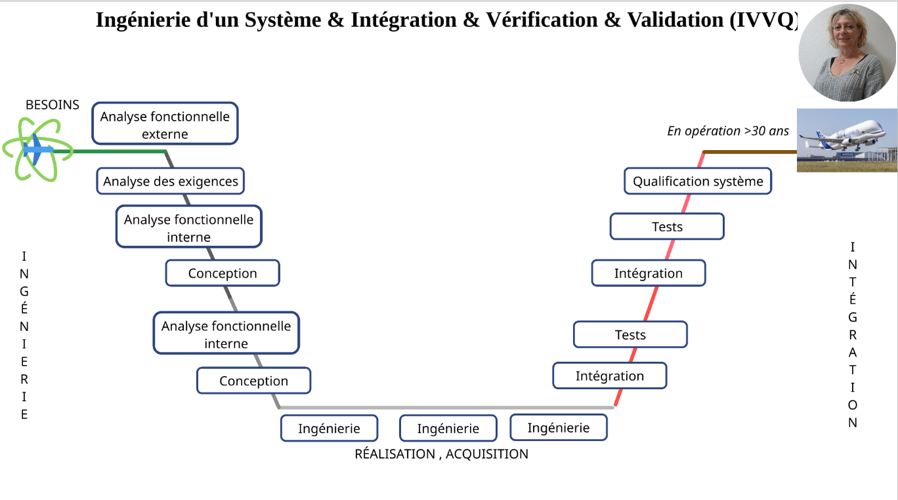{fig-align="center" width="80%"}
:::

#### GI2 

:::{layout="[50,50]"}

:::{}
`Cahier de Charges Fonctionnel / Mgtm par la Valeur`

- Définition des besoins
- Analyse fonctionnelle
- Evaluation des solutions

:::

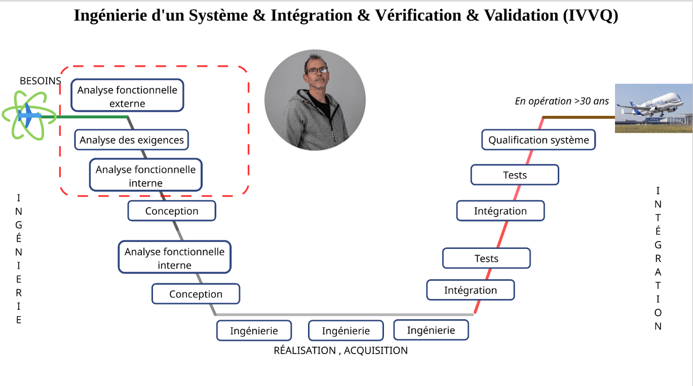{fig-align="center" width="80%"}
:::


#### CI1


:::{layout="[50,50]"}

:::{}
`Créativité`

- Divergence - Convergence
- Piloter les phases d'un projet de créativité collective.
- Techniques de créativité.

:::

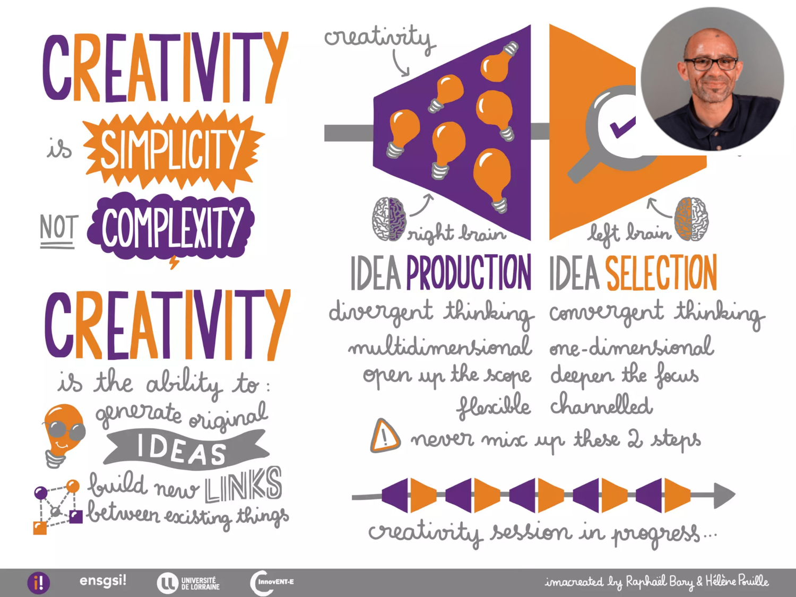{fig-align="center" width="55%"}
:::


#### CI2 

:::{layout="[50,50]"}

:::{}
`Ingénierie de l'innovation I`

- Capacité à diagnostiquer un produit (nouveauté, performance ...)
- Capacité à mettre en place des méthodes de conception et d'analyse
:::

{fig-align="center" width="80%"}
:::


:::


## De quoi on va parler dans ce cours ? 

**Quelle est la signification du mot "Ingénieur" pour vous ?**

. . .

Le mot ingénieur (latin **Ingeniator**) est dérivé des mots latins **Ingeniare** ("concevoir, inventer") et **Ingenium** ("ingéniosité").

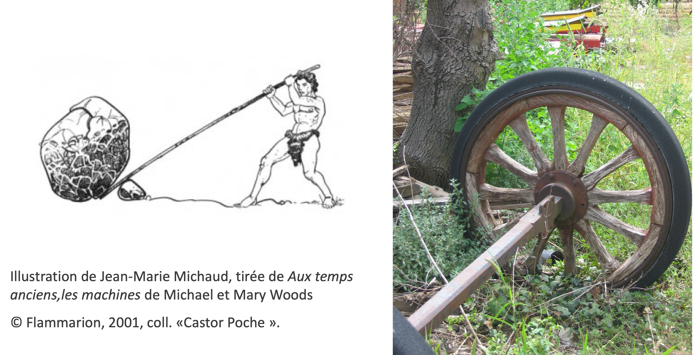{width="70%" fig-align="center"}

---


**Quelle est la signification du mot « Mécanique » pour vous ?**

. . .

**Mathématiques + Physique** → Force, Masse, et *Mouvement*.

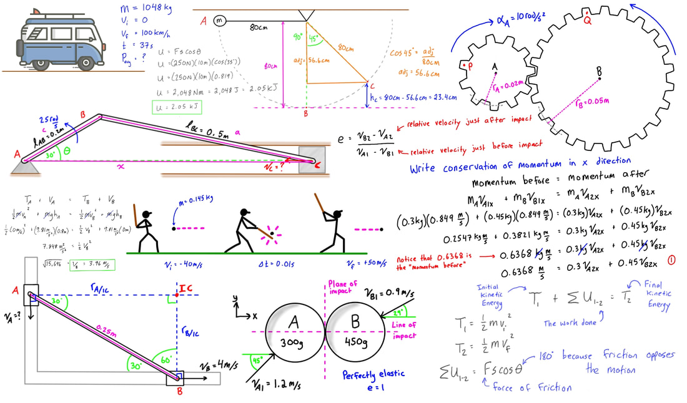{width="60%" fig-align="center"}

:::footer
Source: [engineer4free](https://www.engineer4free.com/uploads/1/0/2/9/10296972/free-online-engineering-dynamics-course_orig.jpg)
:::

## Pourquoi il est important ?


. . .

La conception en ingénierie est un **processus systématique** dans lequel les concepteurs **génèrent**, **évaluent** et **spécifient** des dispositifs, systèmes ou processus dont la forme et la fonction atteignent des *objectifs tout en respectant des contraintes*


:::{layout= "[30, 70]"}
{width="65%" fig-align="center"}

:::{.incremental}
- Processus de sélection heuristique subjective.
- Exploration d'une variété en faisant des hypothèses (implicites/explicites).
- Donner forme à une idée.
- Implémenter un cadre cohérent de test.
- **Avoir l'audace d'échouer est indispensable.**
:::
:::

:::footer
Source: Cross, N. (2021). Engineering design methods: strategies for product design. John Wiley & Sons.
:::


## Pourquoi est-ce important pour vous, futurs ingénieurs en innovation ?

. . .

- **Concevoir un produit/service est une activité complexe** 
  - mobiliser de multiples partenaires de différentes disciplines, 
  - Imaginer des solutions créatives et pratiques, 
  - de tester et vérifier mille problèmes avant soit trop tard


## Le rôle de ce module ?{background-image="CM1/Design-process-02.png" background-size="30%" background-position="70% 50%"}

:::{layout="[30, 70]" layout-valign="center"}

:::{}
{width="65%" fig-align="center"}
:::


:::

:::footer
Source: Cross, N. (2021). Engineering design methods: strategies for product design. John Wiley & Sons.
:::


## Comment va être évalué le module?


**Planification**: Fevrier - Juin 2026

- 7 CM Introduction à la conception mécatronique   
- 2 TD Application de la théorie                               
- TP 1-4 **apprentissage des outils de conception** : CAO, Arduino, découpe laser, impression 3D  
- TP 5-9 Projet développé par Vous!

:::{layout="[50, 50]"}

:::{}
**Examen final (individuel)**: <br>**Coef. 2/3** de la note finale

- Test sous PC
:::

:::{}
**Challenge (groupe)**: <br>**Coef. 1/3** de la note finale

- Participation du Challenge
- Documentation <https://fabmanager.lf2l.fr/>
:::
:::

## Quelles sont les attendus et engagements de votre et notre part? {.scrollable .smaller}

**Referentiel Compétence ENSGSI**

1. C2: **MAITRISER LES SCIENCES POUR L’INGENIEUR NECESSAIRES AUX METIERS DE L’INNOVATION**

   - Analyser les besoins, définir les exigences de conception aux niveaux mécanique et énergétique en amont de la phase d'industrialisation d'un produit, les intégrer à un CDC et réaliser une première ébauche du dimensionnement et de l'optimisation du produit/procédé
   
   - Matérialiser des concepts (réalisation de prototypes ou maquettes, plans numériques, avatars numériques), élaborer des protocoles d’essais

1. C3 : **ELABORER ET IMPLEMENTER DES PROCESSUS D’INNOVATION**
   - Créer les conditions de l’émergence et l’enrichissement de concepts de nouveaux produits (services/procédés/…), à l’aide d’outils collaboratifs de co-innovation (Objets Intermédiaires de Conception, Proof of Concept, …).


# Aperçu du Module {.center background-color="aquamarine"}

**Formez des équipes de quatre/cinq personnes**

-   De préférence, avec vos voisins entre les rangs.

### Challenge Tour autoportante { background-color="aquamarine"}

:::{layout="[70,30]"}
:::{}
- 🎯 Construire une **tour** qui supporte des poids calibrés.

- 🛠️ Utiliser **seulement** les matériaux listés ici →
- 🏆 Critères:

    1.  Il résiste à au moins un poids: Oui / Non
    1. $Hauteur > 2cm$
    1. ⌛  18 minutes. 

$Score= \text{Hauteur}  * (\text{# Vis})$

:::

::: {}
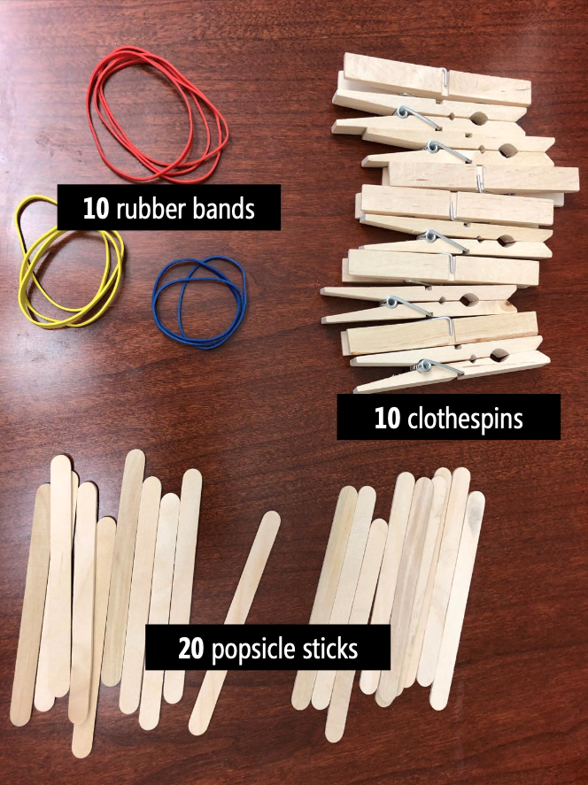


:::
:::


### 18 Minutes {.center background-color="aquamarine"}

```{=html}
<iframe width="90%" height="750" src="https://www.youtube.com/embed/xrxQY3DJn88?si=Bq-NHFp16HWBatwm" title="timer 18 min"></iframe>
```


### [Résultats](https://docs.google.com/spreadsheets/d/1oNOUSItc2kMMvZk9POYV5DZyuCpTbPGLpeVAJU-wxz0/edit?gid=634347005#gid=634347005)


```{=html}
<iframe width="90%" height="750"  src="https://docs.google.com/spreadsheets/d/e/2PACX-1vQ2P-xWITO-DxgSfXuiVI-Or5feXUBGm5ivWh0JZuzjA3TjWtOahrW369jJiZDofVRPigt0zEU1Cvda/pubhtml?gid=634347005&amp;single=true&amp;widget=true&amp;headers=false"></iframe>

```

[Document](https://docs.google.com/spreadsheets/d/1oNOUSItc2kMMvZk9POYV5DZyuCpTbPGLpeVAJU-wxz0/edit?gid=634347005#gid=634347005)

## Réflexion sur le processus de conception

:::{layout="[80,35]"}
:::{.incremental}
- Quelles stratégies avez-vous utilisées pour construire vos tours ?
- Combien de tours avez-vous construites ?
- Combien d'équipes ont esquissé des idées avant de commencer à construire ?
- Combien d'équipes ont essayé plusieurs idées avant de s'arrêter sur une conception finale ?
- Combien d'équipes ont essayé d'utiliser les poids pendant le processus de prototypage ?
- Combien d'équipes ont utilisé des pièces de manière inattendue (ont démonté des pinces à linge) ?
:::


:::


# Introduction à la conception des systèmes mécatroniques {.center background-color="orange"}


## Le rôle du prototypage et la conception mécatronique?

:::{layout="[80,35]"}
:::{}

"Humans are really interesting. If you show them your idea in a prototype form, **very few people will tell you what’s right about it. But everybody will tell you what’s wrong with it**."
:::

:::{}


David Kelly, IDEO
:::
:::

### Ce qu'on attend de vous à la fin de ce module?

::: incremental
1.  Idée → Maquette → Preuve de concept → Prototype
2.  Être capable de **choisir les outils de conception** les plus appropriés.
3.  **Échouer le plus tôt possible**.
:::

{width="70%" fig-align="center"}


### Échouer avec enthousiasme et détermination !

Pour valider des hypothèses de conception.

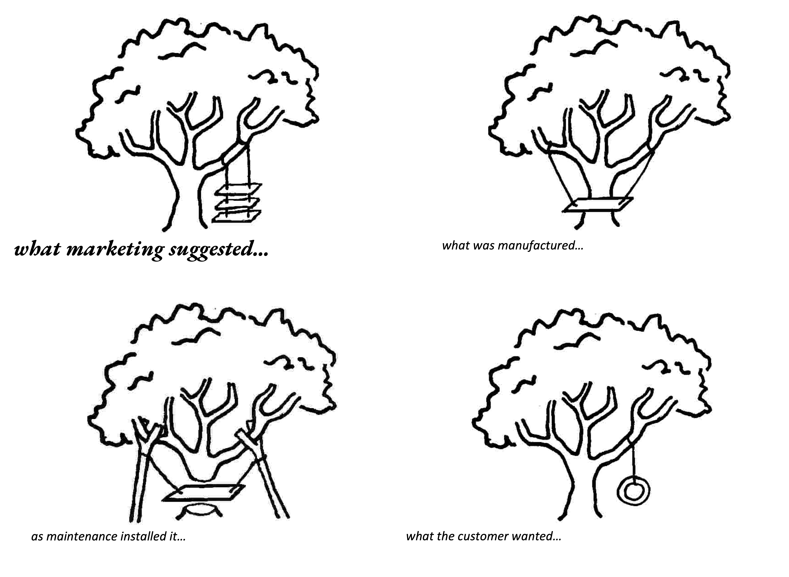{width="60%" fig-align="center"}


## Objectifs d'apprentissage du module

:::{.incremental}

1. Donner les compétences de base pour pouvoir matérialiser une idée conceptuelle en un objet de conception mécatronique intermédiaire pour un concept donné.
2.  Apprendre les technologies de prototypage disponibles au Lorraine Fab Living Lab.
3.  Une base scientifique et technique pour concevoir et construire un prototype de façon autonome. --**Do-It-Yourself**-
:::


### Objectifs d'apprentissage spécifiques

:::{layout="[50,50]"}
:::{}

1.  Phases et techniques de prototypage.
2.  Conception mécatronique :
    - Modélisation CAO
    - Description d'une chaîne cinématique
    - Contrôle
    - Simulation d'un système simple de transformation du mouvement
3.  Les Fablabs et l'approche de l'innovation sociale.
:::

:::{}
**Learning by Doing !**

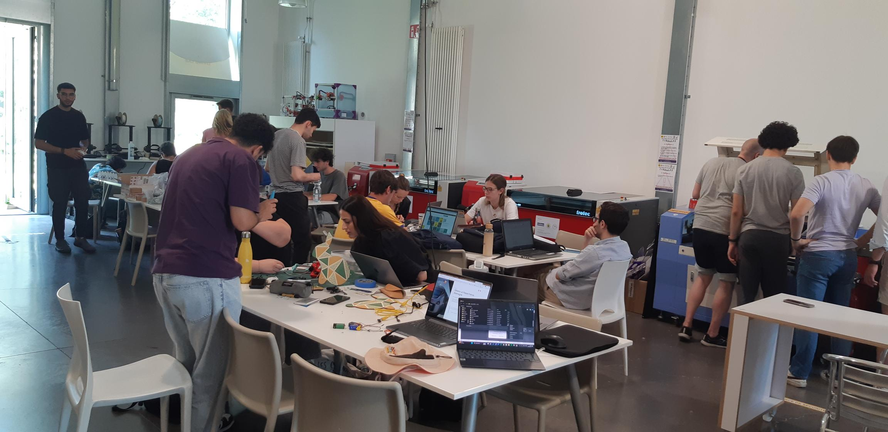
:::
:::


### Technologies at LF2L.

:::{layout="[25,25, 25, 25]"}
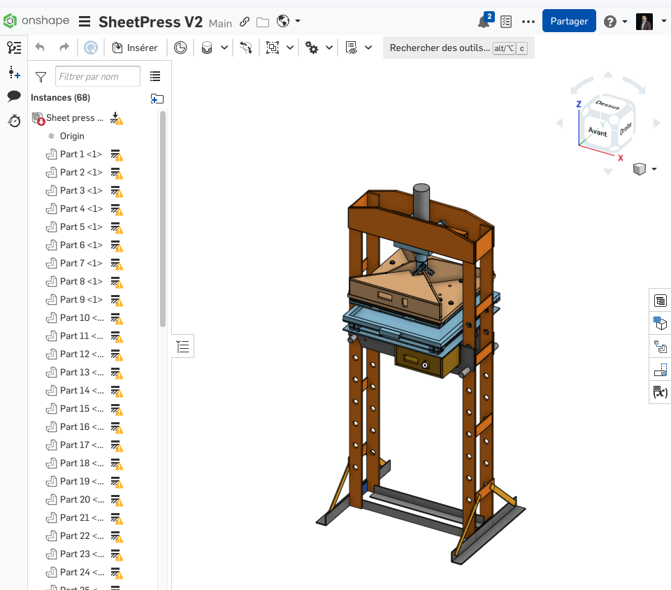{width="100%"}

{width="100%"}

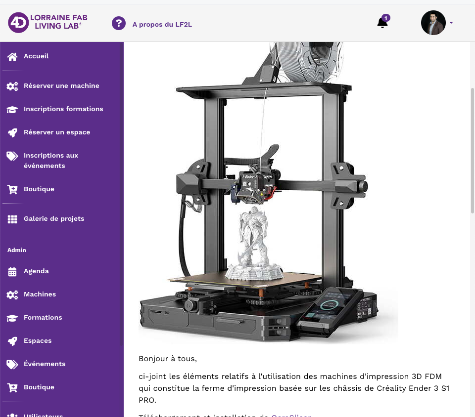{width="100%"}

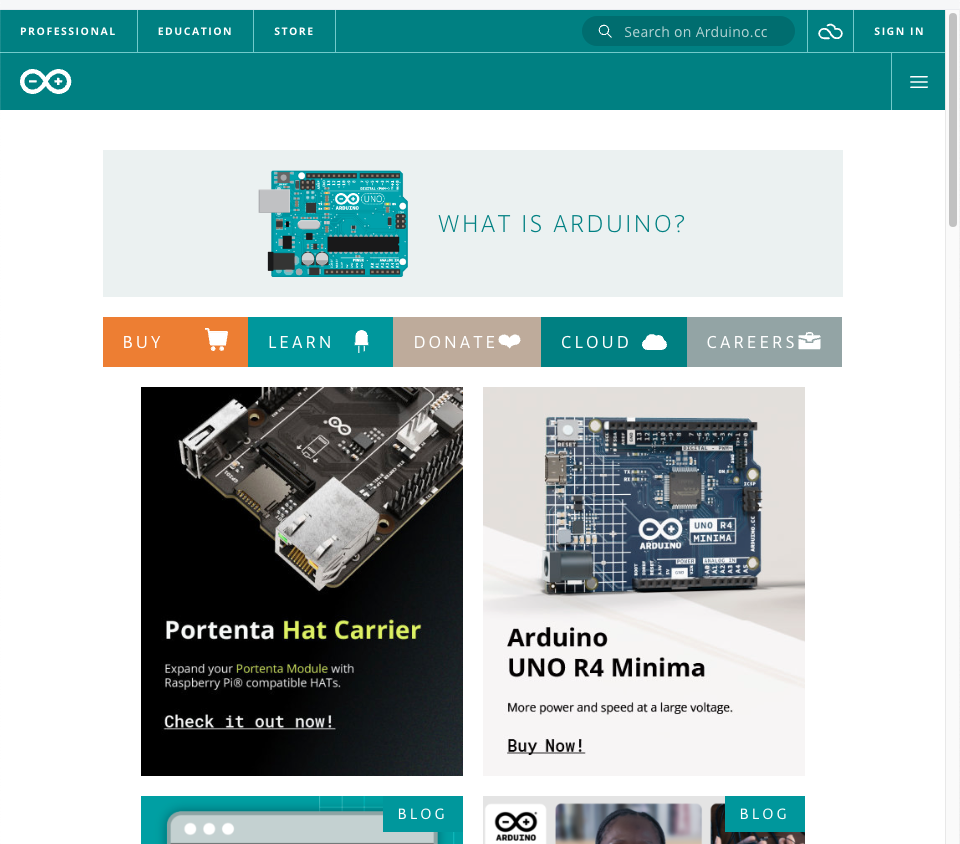{width="100%"}
:::

Documentation: <https://fabmanager.lf2l.fr/>


### Projet de Conception $\rightarrow$ Vision partagé.

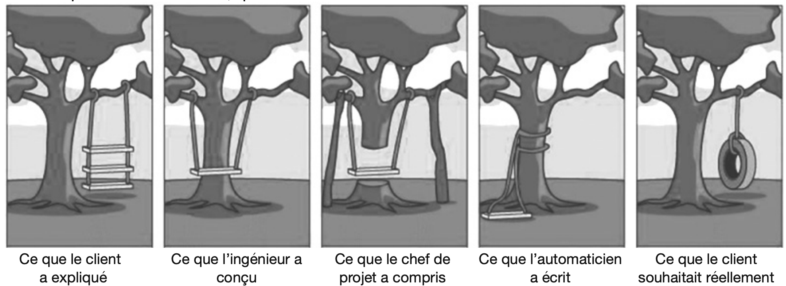{width="80%" fig-align="center"}

-   de mieux définir les exigences,
-   d’améliorer la qualité de la conception,
-   de faciliter le développement des systèmes complexes,
-   de représenter de façon exhaustive le système.


### Ecarts en conception

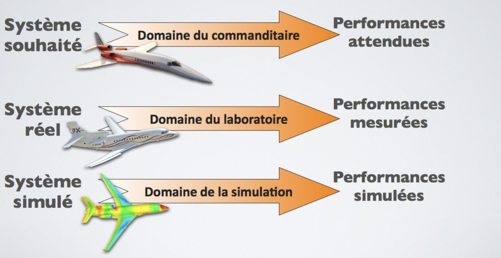{width="80%" fig-align="center"}

### Ecarts en conception

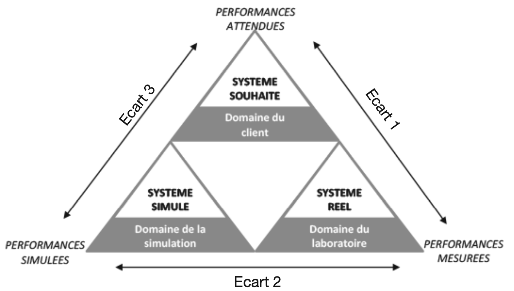{width="100%" fig-align="center"}

### Ecarts en conception

-   **Système souhaité** $\rightarrow$ fonctions du système et de quantifier ses performances.
-   **Système simulé** $\rightarrow$ modélisé par des lois comportementales, de façon à estimer ses capacités à répondre aux attentes du système souhaité.
-   **Système réel** est la conséquence des choix effectués lors des simulations. Il est alors possible de mesurer les performances réelles et de les comparer aux performances attendues.


**Les écarts entre chaque système font l’objet d’analyses et, le cas échéant, d’une reconfiguration.**

### Domain de la Simulation: Dessin technique et CAO

:::{layout="[50, 50]"}
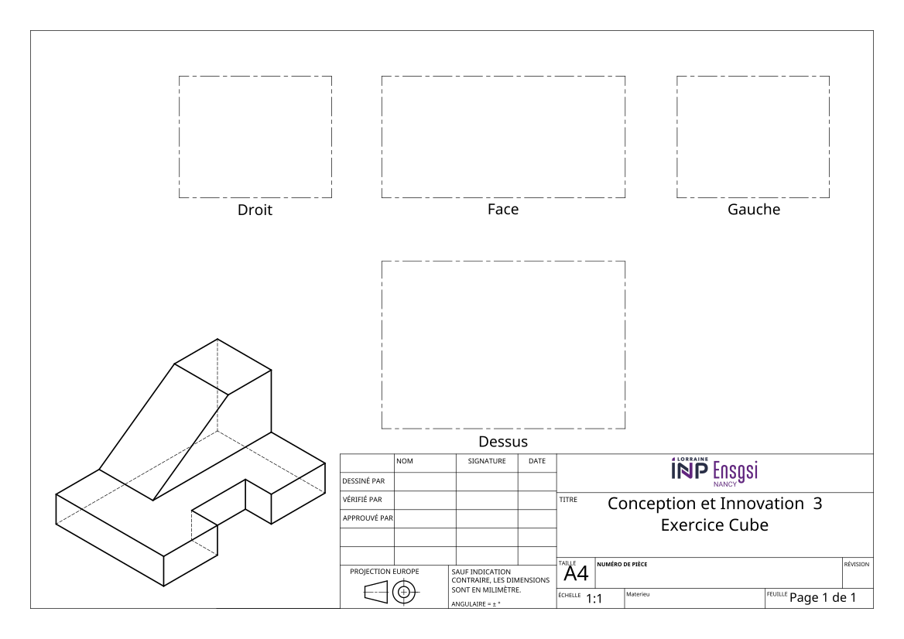{width="100%" fig-align="center"}

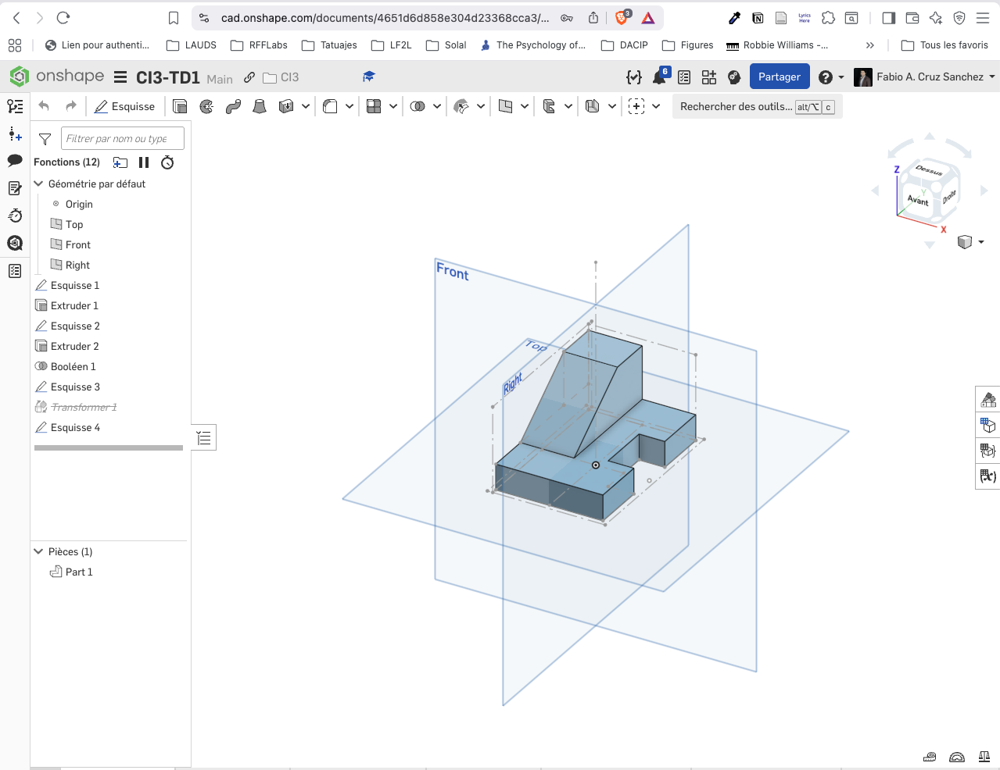{width="100%" fig-align="center"}

:::

On va utiliser le logiciel **Onshape**.
