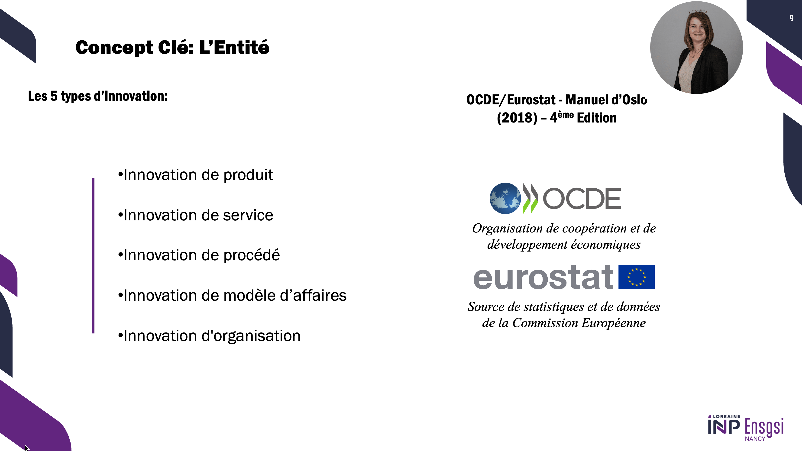
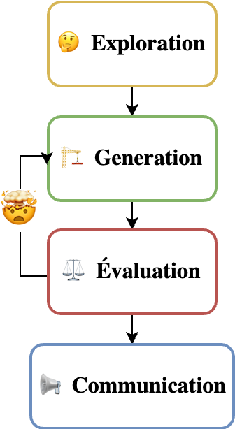
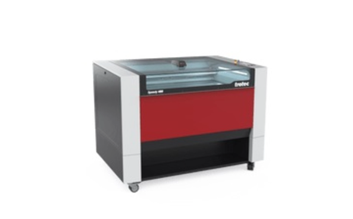

# Introduction
## Conception et Innovation - CI3?

- De quoi parle ce cours ?
- Structure du cours, des attendus, les engagements


### Ligné de la Conception et Innovation du ENSGSI 


::: {.panel-tabset}

#### CI1 - Créativité

{fig-align="center" width="55%"}

#### CI2 Ingénierie de l'innovation I

{fig-align="center" width="80%"}


:::


### Ingénierie et Mécanique
### Quelle est la signification du mot "Ingénieur" pour vous ?

. . .

Le mot Ingénieur (latin **Ingeniator**) est dérivé des mots latins **Ingeniare** ("concevoir, inventer") et **Ingenium** ("ingéniosité").

{width="70%" fig-align="center"}


### Quelle est la signification du mot « Mécanique » pour vous ?

. . .

**Mathématiques + Physique** → Force, Masse, et *Mouvement*.

{width="60%" fig-align="center"}

:::footer
Source: [engineer4free](https://www.engineer4free.com/uploads/1/0/2/9/10296972/free-online-engineering-dynamics-course_orig.jpg)
:::

### Qu'est-ce que la conception en ingénierie ?

La conception en ingénierie est un **processus systématique** dans lequel les concepteurs **génèrent**, **évaluent** et **spécifient** des dispositifs, systèmes ou processus dont la forme et la fonction atteignent des *objectifs tout en respectant des contraintes*


## Challenge {.center background-color="aquamarine"}

**Formez des équipes de quatre/cinq personnes**

-   De préférence, avec vos voisins entre les rangs.

### Challenge Tour autoportante { background-color="aquamarine"}

:::{layout="[70,30]"}
:::{}
- 🎯 Construire une **tour** qui supporte des poids calibrés.

- 🛠️ Utiliser **seulement** les matériaux listées ici →
- 🏆 Critères:

  1.  Il résiste à au moins un poids: Oui / Non
  2. $Hauteur > 2cm$
  2. Coefficients → 🔩 $Vis = 0.6$ $Ecrou = 0.1$
  
 $$ Score= \text{Hauteur} * (\text{# Vis}*0.6 + \text{# Ecrous}*0.6 )  $$ 
:::

::: {}


- ⌛  18 minutes. 
:::
:::


### 18 Minutes {.center background-color="aquamarine"}

```{=html}
<iframe width="90%" height="750" src="https://www.youtube.com/embed/xrxQY3DJn88?si=Bq-NHFp16HWBatwm" title="timer 18 min"></iframe>
```


### [Résultats](https://docs.google.com/spreadsheets/d/1oNOUSItc2kMMvZk9POYV5DZyuCpTbPGLpeVAJU-wxz0/edit?gid=634347005#gid=634347005)


```{=html}
<iframe width="90%" height="750"  src="https://docs.google.com/spreadsheets/d/e/2PACX-1vQ2P-xWITO-DxgSfXuiVI-Or5feXUBGm5ivWh0JZuzjA3TjWtOahrW369jJiZDofVRPigt0zEU1Cvda/pubhtml?gid=634347005&amp;single=true&amp;widget=true&amp;headers=false"></iframe>

```

[Document](https://docs.google.com/spreadsheets/d/1oNOUSItc2kMMvZk9POYV5DZyuCpTbPGLpeVAJU-wxz0/edit?gid=634347005#gid=634347005)

## Réflexion sur le processus de conception

:::{layout="[80,35]"}
:::{}
- Quelles stratégies avez-vous utilisées pour construire vos tours ?
- Combien de tours avez-vous construites ?
- Combien d'équipes ont esquissé des idées avant de commencer à construire ?
- Combien d'équipes ont essayé plusieurs idées avant de s'arrêter sur une conception finale ?
- Combien d'équipes ont essayé d'utiliser les poids pendant le processus de prototypage ?
- Combien d'équipes ont utilisé des pièces de manière inattendue (ont démonté des pinces à linge) ?
:::


:::


# CI3 -- Introduction à la conception des systèmes mécatroniques {.center background-color="orange"}


## Le rôle cette module ?

:::{layout= "[30, 70]"}
{width="65%" fig-align="center"}

:::{.incremental}
- Processus de sélection heuristique subjective.
- Éxploration d'un varieté de en faisant des hypothèses (implicites/explicites).
- Donner forme à une idée.
- Implementer un cadre cohérent de test.
- **Avoir l'audace d'échouer est indispensable.**
:::
:::

:::footer
Source: Cross, N. (2021). Engineering design methods: strategies for product design. John Wiley & Sons.
:::


## Pourquoi est-ce important pour vous, futurs ingénieurs en innovation ?

. . .

- **Concevoir un produit/service est une activité complexe** 
  - mobiliser de multiples partenaires de différentes disciplines, 
  - Imaginer des solutions créatives et pratiques, 
  - de tester et vérifier mille problèmes avant soit trop tard


## Le rôle cette module ?{background-image="figures/CM1/Design-process-02.png" background-size="30%" background-position="70% 20%"}

:::{layout="[30, 70]" layout-valign="center"}

:::{}
{width="65%" fig-align="center"}
:::


:::

:::footer
Source: Cross, N. (2021). Engineering design methods: strategies for product design. John Wiley & Sons.
:::


## Le rôle du prototypage et la conception mécatronique?

:::{layout="[80,35]"}
:::{}

"Humans are really interesting. If you show them your idea in a prototype form, **very few people will tell you what’s right about it. But everybody will tell you what’s wrong with it**."
:::

:::{}


David Kelly, IDEO
:::
:::

### Ce qu'on attends de Vous à la fin de ce module?

::: incremental
1.  Idée → Maquette → Preuve de concept → Prototype
2.  Être capable de **choisir les outils de conception** les plus appropriés.
3.  **Échouer le plus tôt possible**.
:::

{width="70%" fig-align="center"}


### Échouer avec Enthousiasme et Détermination !

Pour valider des hypothèses de conception.

{width="60%" fig-align="center"}


## Objectifs d'apprentissage du module

:::{.incremental}

1. Vous donner les compétences de base pour pouvoir matérialiser une idée conceptuelle en un objet de conception mécatronique intermédiaire pour un concept donné.
2.  Apprendre les technologies de prototypage disponibles au Lorraine Fab Living Lab.
3.  Une base scientifique et technique pour concevoir et construire un prototype de façon autonome. --**Do-It-Yourself**-
:::


### Objectifs d'apprentissage spécifiques

:::{layout="[50,50]"}
:::{}

1.  Phases et techniques de prototypage.
2.  Conception mécatronique :
    - Modélisation CAO
    - Description d'une chaîne cinématique
    - Contrôle
    - Simulation d'un système simple de transformation du mouvement
3.  Les Fablabs et l'approche de l'innovation sociale.
:::

:::{}
**Learning by Doing !**


:::
:::


### Planification

- 7 CM Introduction à la conception mécatronique   
- 2 TD Application de la théorie                               
- TP 1-4 **Apprentissage des outils de conception** : CAO, découpe laser, impression 3D  
- TP 5-9 Projet développé par vous 


### Technologies at LF2L.

:::{layout="[25,25, 25, 25]"}
{width="100%"}

{width="100%"}

{width="100%"}

{width="100%"}
:::

Documentation: <https://fabmanager.lf2l.fr/>


### Evaluation du Module

:::{layout="[50, 50]"}
:::{}
**Individuel**

Test sous PC (**Weight: 2/3**)
:::

:::{}
**Challenge par Groups**

Presentation of the mechanism
Documentation of the mechanism on <https://fabmanager.lf2l.fr/>
:::
:::

### Merci

**Prochaine fois: 11/03/2024**