# Modélisation des liaisons mécaniques

## Conception en V

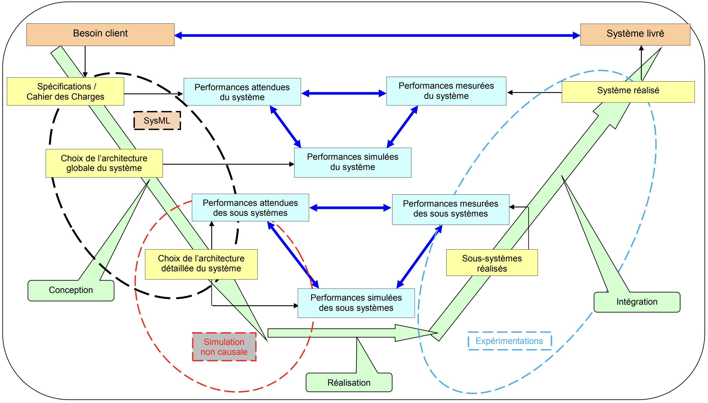{width="80%" fig-align="center"}

## Mécanisme {background-image="CM3/turbina.gif" background-size="30%" background-position="95% 30%"}

**Définition**:

::: {layout="[65,30]" layout-valign="top"}
On appelle mécanisme, un *ensemble de pièces mécaniques* reliées entre elles par des *liaisons*, en vue de réaliser une fonction déterminée.
:::

. . .

Nous admettrons que les pièces mécaniques peuvent être modélisées par des **solides indéformables**.

## Solides Indeformables

::: {layout="[70,30]" layout-valign="center"}
::: callout-note
#### Conséquence géométrique

La distance entre deux points quelconques d’un solide indéformable est invariable dans un **Repère donneé**
:::

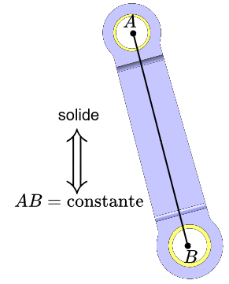{width="90%" fig-align="center"}
:::

## Repère

::: {layout="[60,40]" layout-valign="top"}
Pour connaitre la position de tous ses points dans l’espace, il suffit de connaitre la position d’un repère lié à ce solide.    
**Repère de référence**: $R(O, \vec{x}, \vec{y}, \vec{z})$   
**Repère de lié au solide.**: $R(O_1, \vec{x_1}, \vec{y_1}, \vec{z_1})$

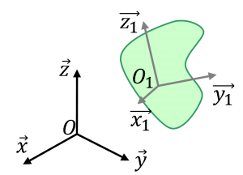{width="80%" fig-align="center"}
:::

. . .

La position du solide dans l’espace, est déterminée par *6 paramètres indépendants*

1.  Position du point $O_1$ → **3 Coordonnées**
2.  Orientation de $\vec{x_1}, \vec{y_1}, \vec{z_1})$ par rapport à $R(O, \vec{x}, \vec{y}, \vec{z})$ → **3 Angles**

### Repère {background-image="CM3/Repere-02.gif" background-size="30%" background-position="90% 20%"}

::: {layout="[50,50]" layout-valign="top"}
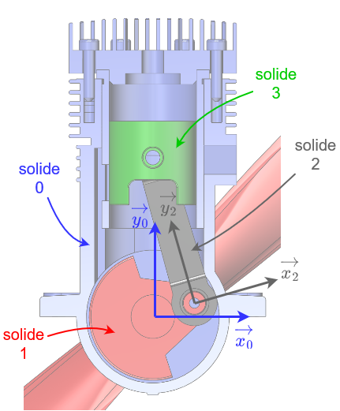{width="50%" fig-align="center"}

:::

*Exemple* : Repère local lié au Solide 2 (la bielle) et Repère de référence, lié au solide 0 (le bâti)

## Degree de liberté

Il existe deux *mouvements élémentaires* entre les solides :

::: {layout="[60,50]" layout-valign="center"}

1.  **TRANSLATION (RECTILIGNE)** : les trajectoires de tous les points du solide sont des droites parallèles.
2.  **ROTATION** : les trajectoires de chaque point sont des cercles coaxiaux.

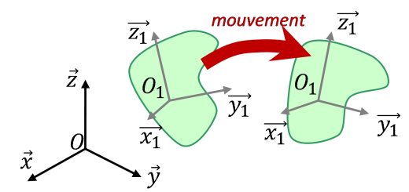{width="100%" fig-align="center"}
:::

On appelle *libertés* d’un solide par rapport à un référentiel, les mouvements indépendants de ce solide pour passer d’une position à une autre.

### Degree de Liberté {background-image="CM3/Degrees-liberte.png" background-size="20%" background-position="85% 85%"}

1.  **TRANSLATION (RECTILIGNE)** : les trajectoires de tous les points du solide sont des droites parallèles.
    -   $T_x, T_y, T_z$ selon $(x,y,z)$
2.  **ROTATION** : les trajectoires de chaque point sont des cercles coaxiaux.
    -   $R_x, R_y, R_z$ autour des axes $(x,y,z)$

**6 Degrees de liberté**

## Notion de liaison

On appelle **liaison** entre deux solides l’ensemble des couples de surfaces en contact entre ces deux solides, **visant à diminuer la mobilité entre ces deux solides**.

**Zones de Contacts**

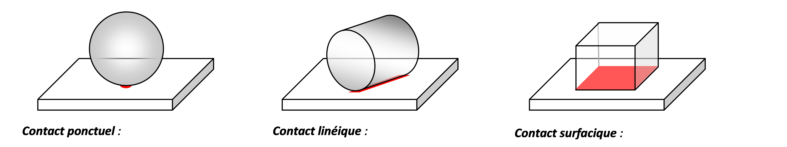{width="80%" fig-align="center"}

## Degrés de liberté d’une liaison

Les *degrés de liberté d’une liaison* sont **les déplacements élémentaires indépendants** autorisés par cette liaison.

## Les Liaisons Mécaniques Elementaires

Selon la norme NF EN ISO 3952-1

### Encastrement

{width="80%" fig-align="center"}

### Pivot d'Axe

{width="80%" fig-align="center"}

### Glissière

{width="80%" fig-align="center"}

### Rotule

::: {.panel-tabset}

#### À vous !
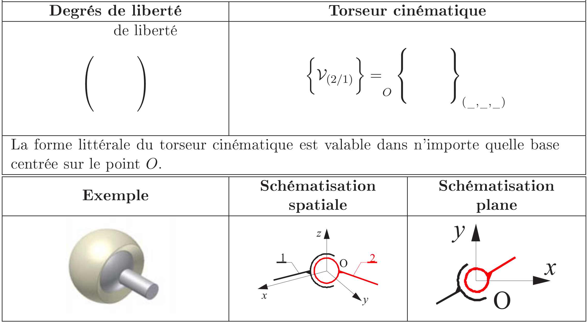{width="70%" fig-align="center"}

#### Solution
{width="70%" fig-align="center"}
:::

### Pivot glissant

::: {.panel-tabset}
#### À vous !
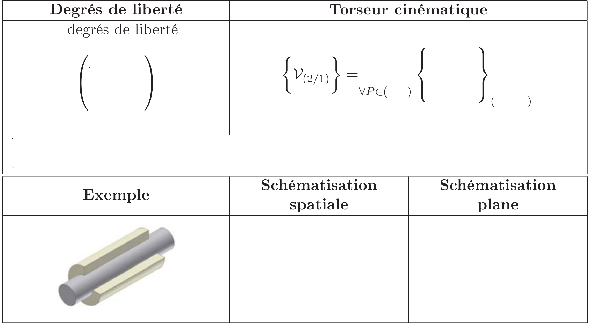{width="70%" fig-align="center"}

#### Solution
{width="70%" fig-align="center"}
:::

### Appui Plan Normale

::: {.panel-tabset}
#### À vous !
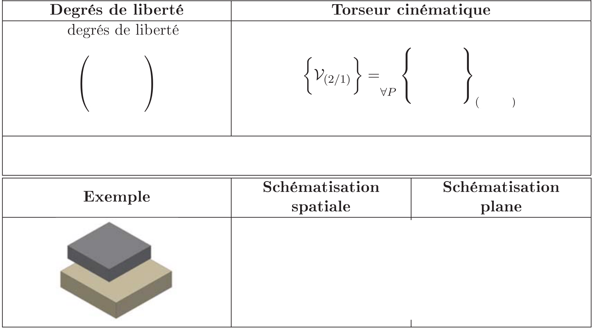{width="70%" fig-align="center"}

#### Solution
{width="70%" fig-align="center"}
:::

### Liste de liaisons standard

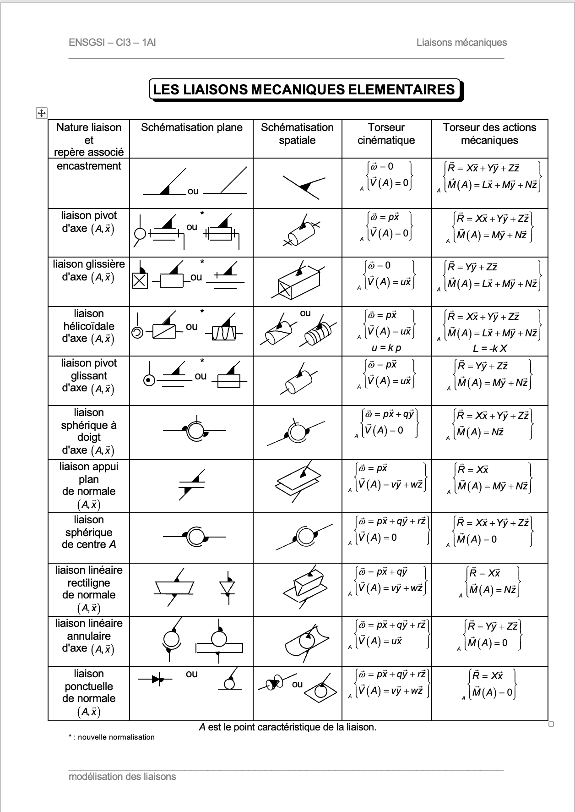{width="70%" fig-align="center"}

## Pour quoi faire?

. . .
Construire un schéma cinématique, une représentation simplifiée d’un mécanisme permettant **une meilleure compréhension du fonctionnement**.

# Élaboration d’un schéma cinématique

## Définition

Le schéma cinématique d’un mécanisme est un modèle filaire du mécanisme utilisant les symboles normalisés des liaisons.

Ce modèle est utile tant au niveau de la conception que de l’analyse à posteriori pour réaliser l’étude cinématique ou dynamique (trajectoire, vitesse, efforts, etc.)

## Example 1 {background-image="CM3/turbina.gif" background-size="30%" background-position="95% 30%"} 

**Modélisation cinématique d’un micromoteur de modélisme**

### Etapes  {background-image="CM3/turbina.gif" background-size="30%" background-position="95% 30%"} 

1. Regroupement des pièces en ensembles solides
2. Élaboration du graphe des liaisons
3. Construction du schéma cinématique

### Etapes  {background-image="CM3/Schema-Cine-01.png" background-size="25%" background-position="95% 30%"} 

1. **Regroupement des pièces en ensembles solides**
2. [Élaboration du graphe des liaisons]{.grey}
3. [Construction du schéma cinématique]{.grey}

::: {layout="[70,30]" layout-valign="center"}
::: {.class}
  
🔎 On regroupe les pièces dans des ensembles (appelés classes d’équivalence cinématique)

✍️ Un nom (un numéro par exemple)

🔵 Une couleur
:::
:::

### Etapes  {background-image="CM3/Repere-01.png" background-size="20%" background-position="85% 10%"} 

1. [Regroupement des pièces en ensembles solides]{.grey}
2. **Élaboration du graphe des liaisons**
3. [Construction du schéma cinématique]{.grey}

::: {layout="[70,30]" layout-valign="center"}

:::.{}
  

✓ Choix d’une base pour le solide de référence (bâti) 
✓ Recherche des contacts entre les solides 
✓ Étude des liaisons entre les solides
:::

 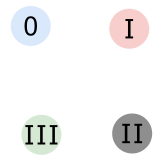{width="50%" fig-align="center"}
:::

### Etapes  {background-image="CM3/Liaison-1.gif" background-size="20%" background-position="85% 10%"} 

1. [Regroupement des pièces en ensembles solides]{.grey}
2. **Élaboration du graphe des liaisons**
3. [Construction du schéma cinématique]{.grey}

::: {layout="[80,20]" layout-valign="center"}

:::.{}
  
Analyser pour ***chaque laiaison***

✓ Surfaces en contact → (plan/plan, sphère/cylindre, ...) 
✓ Degrés de liberté 
✓ Identification de composants
:::
:::

### Etapes  {background-image="CM3/Schema-Cine-02.png" background-size="30%" background-position="95% 30%"} 

1. [Regroupement des pièces en ensembles solides]{.grey}
2. **Élaboration du graphe des liaisons**
3. [Construction du schéma cinématique]{.grey}

::: {layout="[80,20]" layout-valign="center"}

:::.{}
  
Analyser pour ***chaque laiaison***

$L_{0-1}$ : Pivot d’axe $(𝐴,\vec{z})$ 
$L_{1-2}$ : Pivot d’axe $(𝐵,\vec{z})$ 
$L_{2-3}$ : Pivot glissant d’axe $(𝐶,\vec{z})$ 
$L_{3-0}$ : Pivot glissant d’axe $(𝐴,\vec{y})$ 

:::
:::

### Etapes  {background-image="CM3/Schema-Cine-03.png" background-size="30%" background-position="95% 30%"} 

1. [Regroupement des pièces en ensembles solides]{.grey}
2. [Élaboration du graphe des liaisons]{.grey}
3. **Construction du schéma cinématique**

::: {layout="[80,20]" layout-valign="center"}

:::.{}
  
✓ Tracé des éléments de situation des liaisons  
[✓ Dessin des symboles des liaisons]{.grey}  
[✓ Simuler]{.grey}
:::
:::

### Etapes  {background-image="CM3/Schema-Cine-04.png" background-size="30%" background-position="95% 30%"} 

1. [Regroupement des pièces en ensembles solides]{.grey}
2. [Élaboration du graphe des liaisons]{.grey}
3. **Construction du schéma cinématique**

::: {layout="[80,20]" layout-valign="center"}

:::.{}
  
[✓ Tracé des éléments de situation des liaisons]{.grey}  
✓ Dessin des symboles des liaisons  
[✓ Simuler]{.grey}
:::
:::

### Etapes  {background-image="CM3/Schema-Cine-04.gif" background-size="12%" background-position="90% 30%"} 

1. [Regroupement des pièces en ensembles solides]{.grey}
2. [Élaboration du graphe des liaisons]{.grey}
3. **Construction du schéma cinématique**

::: {layout="[80,20]" layout-valign="center"}

:::.{}
  
[✓ Tracé des éléments de situation des liaisons]{.grey}  
[✓ Dessin des symboles des liaisons]{.grey}  
✓ Simuler
:::

:::

## 💻 Simuler pour mieux comprendre.

::: {layout="[50,40]" layout-valign="center"}

Introduction to Mechanism Design  
Source: [http://benchtophybrid.com/mechdes/ch01/driverDyad.html?sel=0](http://www.mechdes.net/)

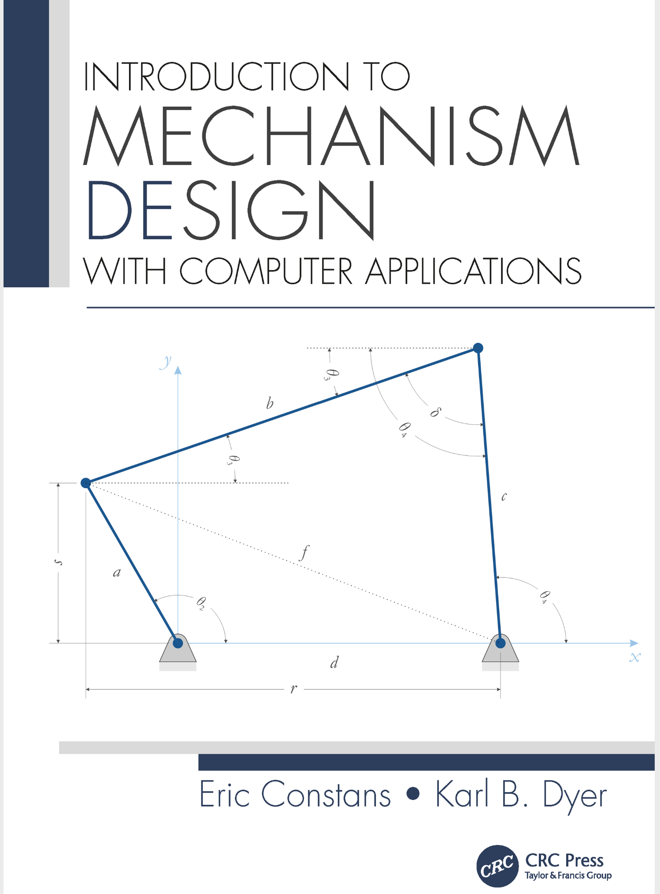{width="80%" fig-align="center"}
:::

## Example 2: Vélo elliptique VE680

## Example 2: Vélo elliptique VE680

::: {.panel-tabset}

#### Contexte

::: {layout="[80,20]" layout-valign="center"}

:::{}
Société Décathlon commercialise le système du vélo elliptique de marque Domyos, modèle VE 680.

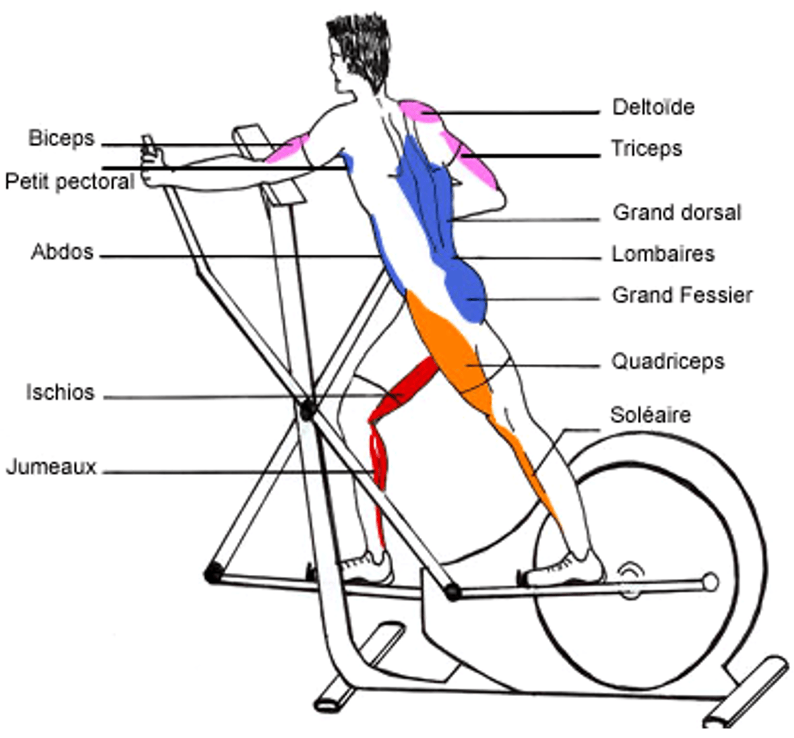{width="500px" fig-align="center"}
:::

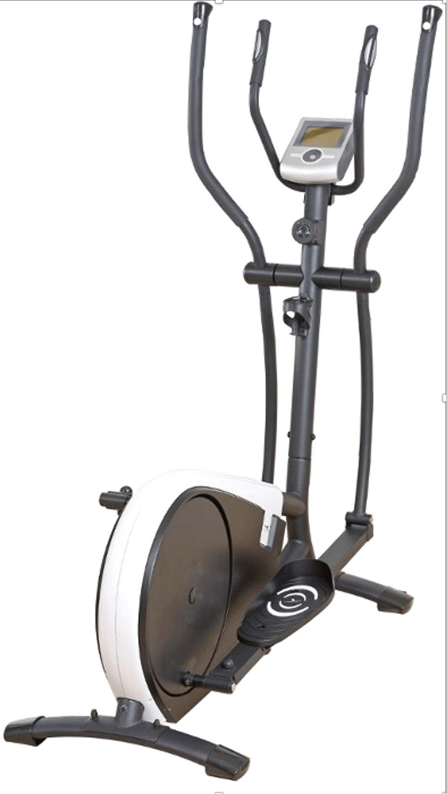{width="70%" fig-align="center"}
:::

#### Analyse du besoin

::: {layout="[50,50]" layout-valign="center"}

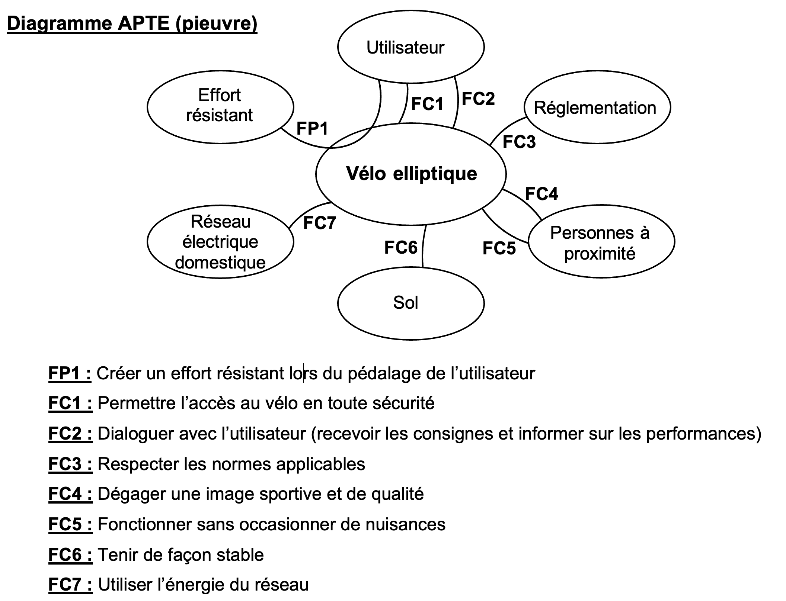{width="100%" fig-align="center"}

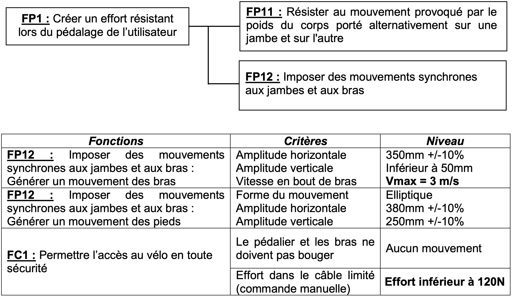{width="100%" fig-align="center"}

:::

#### Chaîne d'Energie

::: {layout="[60,50]" layout-valign="center"}

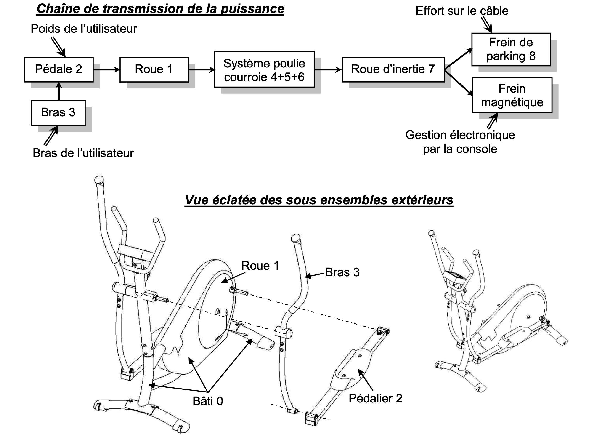{width="100%" fig-align="center"}

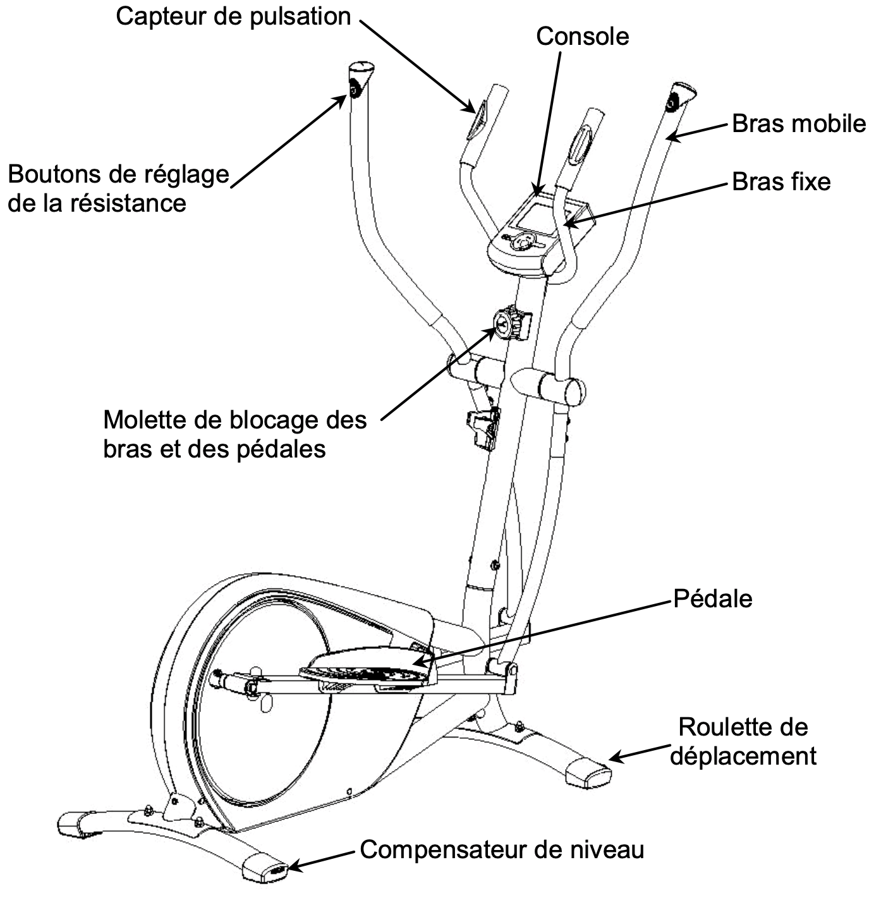{width="100%" fig-align="center"}

:::

:::

## Example 2 {.top}

**Modélisation cinématique d’une Vélo elliptique**

### Etapes  {background-image="CM3/Velo-00.gif" background-size="30%" background-position="95% 30%"} 

1. Regroupement des pièces en ensembles solides
2. Élaboration du graphe des liaisons
3. Construction du schéma cinématique

### Etapes  {background-image="CM3/Velo-fonctionnelle-06.png" background-size="30%" background-position="95% 0%"} 

1. **Regroupement des pièces en ensembles solides**
2. [Élaboration du graphe des liaisons]{.grey}
3. [Construction du schéma cinématique]{.grey}

::: {layout="[70,30]" layout-valign="bottom"}
::: {}
  
🔎 On regroupe les pièces dans des ensembles  (appelés classes d’équivalence cinématique)

✍️ Un nom (un numéro par exemple)

🔵 Une couleur
:::

::: {}
  
⬛ 1 bâti  
🟥 2 bras  
🟩 2 pédales  
🟦 2 articulations  
🟨 1 pédalier  
:::
:::

### Etapes  {background-image="CM3/Velo-fonctionnelle-10.png" background-size="40%" background-position="95% 10%"} 

1. [Regroupement des pièces en ensembles solides]{.grey}
2. **Élaboration du graphe des liaisons**
3. [Construction du schéma cinématique]{.grey}

::: {layout="[70,30]" layout-valign="center"}

:::.{}
✓ Choix d’une base pour le solide de référence (bâti) 
✓ Recherche des contacts entre les solides 
✓ Étude des liaisons entre les solides
:::
:::

### Etapes  

::: {layout="[80,20]" layout-valign="top"}
::: {}
1. [Regroupement des pièces en ensembles solides]{.grey}
2. **Élaboration du graphe des liaisons**
3. [Construction du schéma cinématique]{.grey}
:::

:::{}
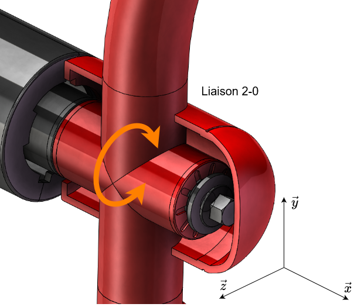
:::
:::

::: {layout="[80,20]" layout-valign="top"}
:::.{}
Analyser pour ***chaque liaison***

✓ Surfaces en contact → (plan/plan, sphère/cylindre, ...) 
✓ Degrés de liberté 
✓ Identification de composants
:::

::: {}
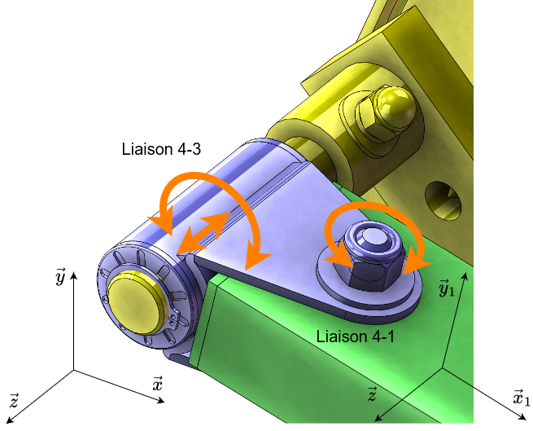
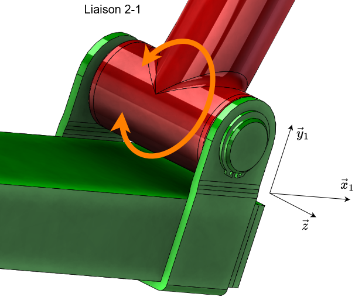
:::

:::

### Etapes  {background-image="CM3/Velo-fonctionnelle-10.png" background-size="40%" background-position="95% 10%"} 

1. [Regroupement des pièces en ensembles solides]{.grey}
2. **Élaboration du graphe des liaisons**
3. [Construction du schéma cinématique]{.grey}

::: {layout="[80,20]" layout-valign="center"}

:::.{}
Analyser pour ***chaque liaison***

$L_{0-2}$ : Pivot d’axe $(𝐴,\vec{z})$ 
$L_{1-2}$ : Pivot d’axe $(B,\vec{z})$ 
$L_{1-4}$ : Pivot glissant d’axe $(C,\vec{v})$ 
$L_{3-4}$ : pivot glissant d’axe $(D,\vec{z})$ 
$L_{3-0}$ : Pivot d’axe $(E,\vec{z})$ 
:::
:::

### Etapes  {background-image="CM3/Velo-fonctionnelle-12.png" background-size="40%" background-position="100% 30%"} 

1. [Regroupement des pièces en ensembles solides]{.grey}
2. [Élaboration du graphe des liaisons]{.grey}
3. **Construction du schéma cinématique**

::: {layout="[80,20]" layout-valign="center"}

:::.{}
 
✓ Tracé des éléments de situation des liaisons  
✓ Dessin des symboles des liaisons  
[✓ Simuler]{.grey}
:::
:::

### Etapes  {background-image="CM3/Velo-00.gif" background-size="40%" background-position="100% 30%"} 

1. [Regroupement des pièces en ensembles solides]{.grey}
2. [Élaboration du graphe des liaisons]{.grey}
3. **Construction du schéma cinématique**

::: {layout="[80,20]" layout-valign="center"}

:::.{}
  
[✓ Tracé des éléments de situation des liaisons]{.grey}  
[✓ Dessin des symboles des liaisons]{.grey}  
✓ Simuler
:::

:::

## 💻 Simuler pour mieux comprendre.

::: {layout="[50,50]" layout-valign="center"}

:::.{}
✓ Simuler par example:

- Vitesses
:::

<iframe loading="lazy" style="border: 0px;" title="Equiprojectivité - vélo elliptique" src="https://www.geogebra.org/material/iframe/id/rmnb32bg/width/800/height/850/border/888888/sfsb/true/smb/false/stb/false/stbh/false/ai/false/asb/false/sri/true/rc/false/ld/false/sdz/true/ctl/false" width="800px" height="850px" scrolling="no"> </iframe>
:::

## Message clé de cette séance

## Questions?

## TD

### Exercise 1

{width="50%" fig-align="center"}

### Exercise 2

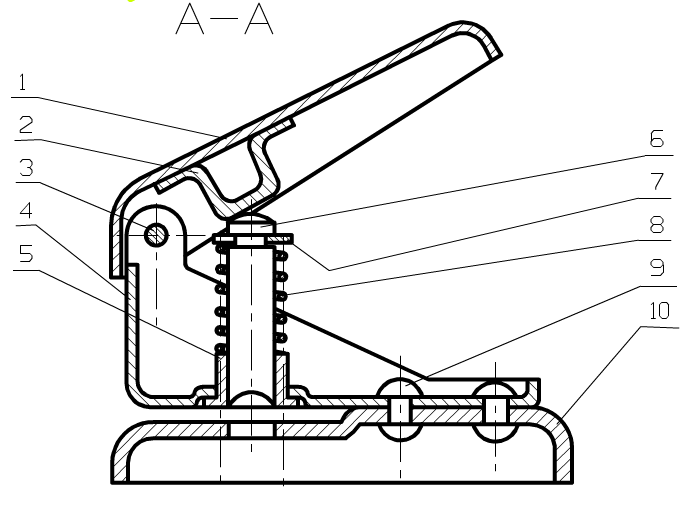{width="50%" fig-align="center"}

### Exercise 3

{width="50%" fig-align="center"}

### Exercise 4

{width="30%" fig-align="center"}

---

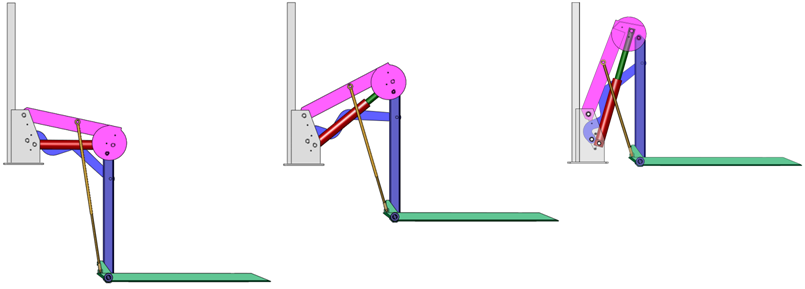{width="100%" fig-align="center"}

