# How it started... 

## {background-image="challenge/Started-00.png" background-size="cover" style="color: #FFFF"}

How it started !!

## { background-image="challenge/Started-01.png" background-size="cover"}

## how it's going ...

## {background-image="challenge/Started-02.png" background-size="cover" style="color: #FFFF"}

:::{layout="[30,-5, 38,-5,30]" layout-valign="top"}

{ .fragment width="500px" fig-align="center"}

{.fragment width="500px"  fig-align="center"}

{.fragment width="500px"  fig-align="center"}
:::

## Avant de démarrer avec les hostilités.. 

## {background-image="challenge/feedback.png" background-size="30%" }

## 

On recuperar l'**Electronique** et les pièces en **impression 3D** ♻️ ❗❗❗❗

{width="500px"  fig-align="center"}

## et maintenant !

{fig-align="center"}

# Let's begin. 

## Règles du Jeu

::: {.callout-important title=""}
La compétition se déroulera en deux étapes :

1. **Test individuel** : Évaluation du mécanisme en fonctionnement autonome, sans adversaire.
    - 3 essais maximum pour évaluer le bon fonctionnement de votre mécanisme.

2. **Test en confrontation directe** : Affrontement entre deux équipes sur la même arène.
   -  Chaque match se joue en 2 manches gagnantes.

**Note** :
*Pour mieux gérer le temps, le format des confrontations directes pourra être ajusté en cours de route.*
:::

🕒 13:45 - 15:45 !

## {background-image="challenge/Challenge-CI3.jpg" background-size="40%"}

[Canva CI3 ranking](https://www.canva.com/design/DAGoWou_r5A/R6BQfmlracbm1fvZPrweBQ/edit){target="_blank"}

## Joker 

Seulement pour les 3 premiers rounds

Les équipes éliminées auront une chance de réintégrer la compétition grâce à une roue aléatoire 

{width="100%" fig-align="center"}

[https://spinthewheel.io/fr](https://spinthewheel.io/fr) 

## Joker {background-iframe="https://spinthewheel.io/wheels/YFtMKG8dwWT8XzuPX10w" background-interactive="true" style="color: #FFFF"}

# Notre Jury

:::{layout="[30,-5, 30,-5,30]" layout-valign="top"}

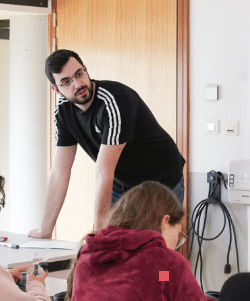{width="100%" fig-align="center"}

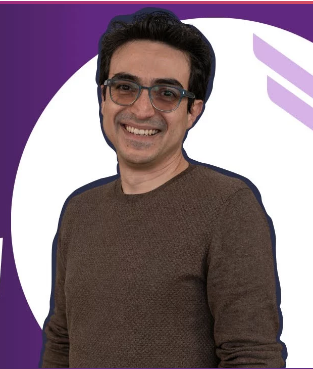{width="100%" fig-align="center"}

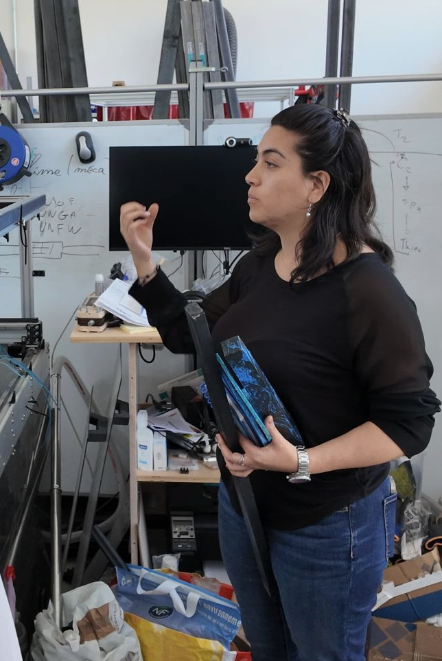{width="100%" fig-align="center"}
:::

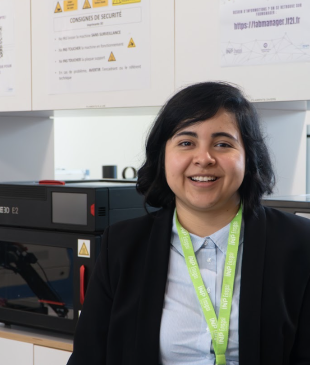{.absolute .fragment bottom=0 left=0 width="300"} 
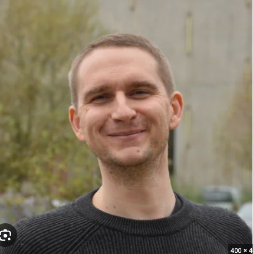{.absolute .fragment bottom=0 left=350 width="300"} 

## Grille d'Evaluation

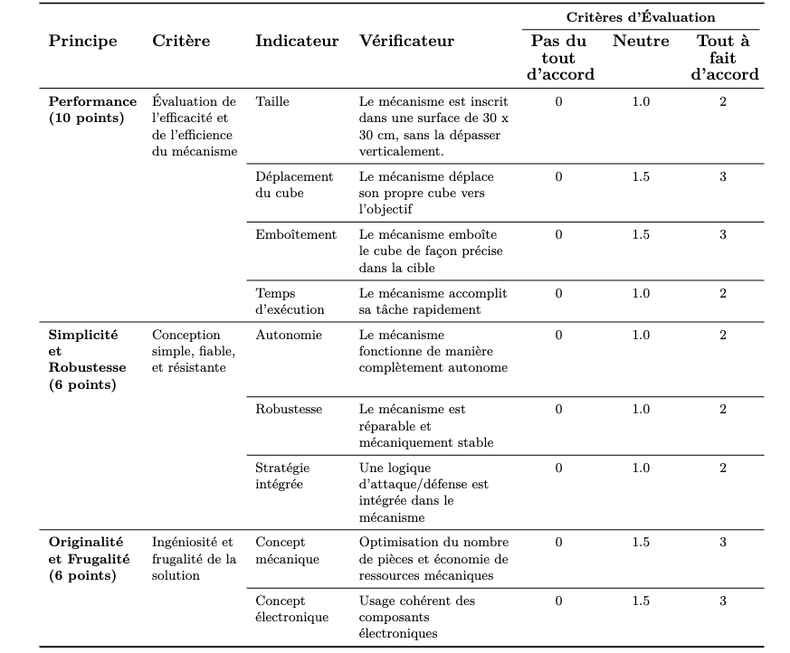{width="100%" fig-align="center"}

## Des questions?

## Est qu'il y a un prix pour le gagnant?

{width="100%" fig-align="center"}

## Est qu'il y a un prix pour le gagnant?

{width="100%" fig-align="center"}

## D'autres questions?

{width="100%" fig-align="center"}

# The war begins !!

## Brasquito Vs ROBOCOOOOT

:::{layout="[45,-5, 45]" layout-valign="top"}

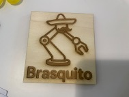{width="600px" fig-align="center"}

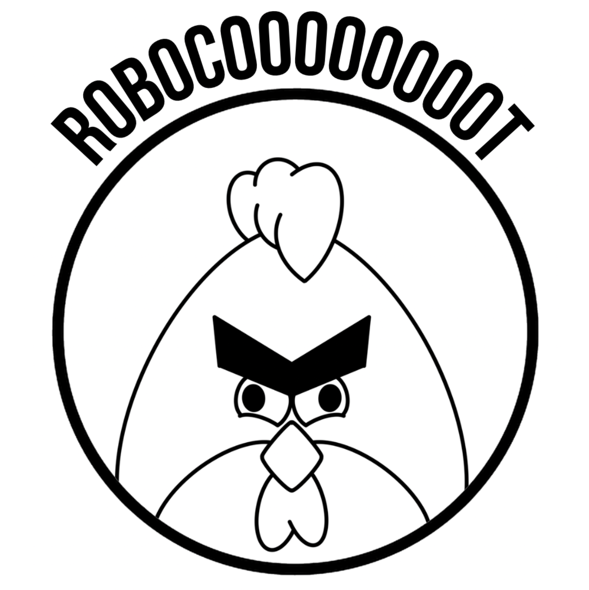{width="500px" fig-align="center"}
:::

## DUOPALES Vs. Thibaud & co 

:::{layout="[45,-5, 45]" layout-valign="top"}

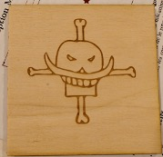{width="600px" fig-align="center"}

{width="600px" fig-align="center"}

:::

## Crabe chirac Vs. E-GLOU

:::{layout="[45,-5, 45]" layout-valign="top"}

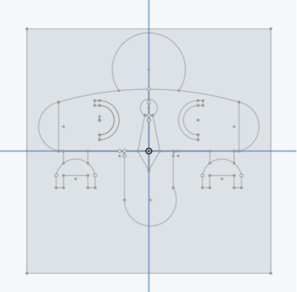{width="600px" fig-align="center"}

{width="600px" fig-align="center"}

:::

## YAT Vs. La Tour de Pise

:::{layout="[45,-5, 45]" layout-valign="top"}

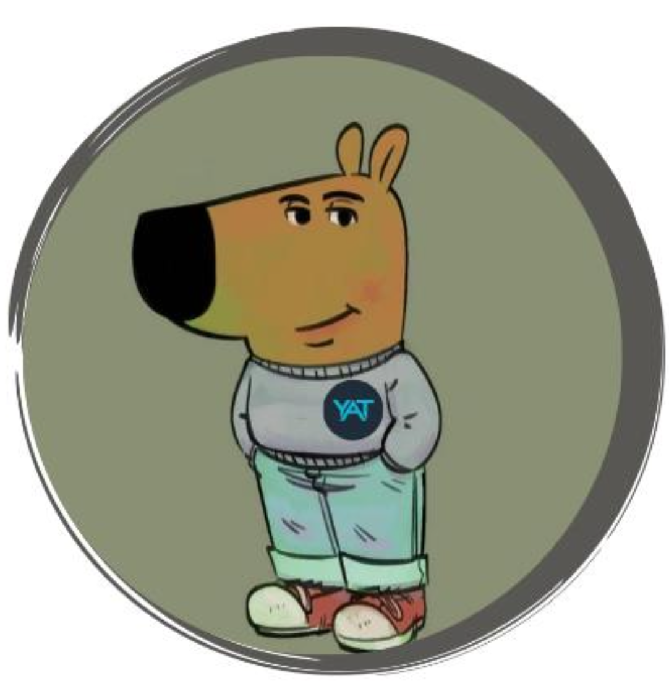{width="600px" fig-align="center"}

{width="600px" fig-align="center"}

:::

## DiplodoCube Vs. Botchou

:::{layout="[45,-5, 45]" layout-valign="top"}

{width="600px" fig-align="center"}

{width="600px" fig-align="center"}

:::

## La cage Vs. Bras Levis

:::{layout="[45,-5, 45]" layout-valign="top"}

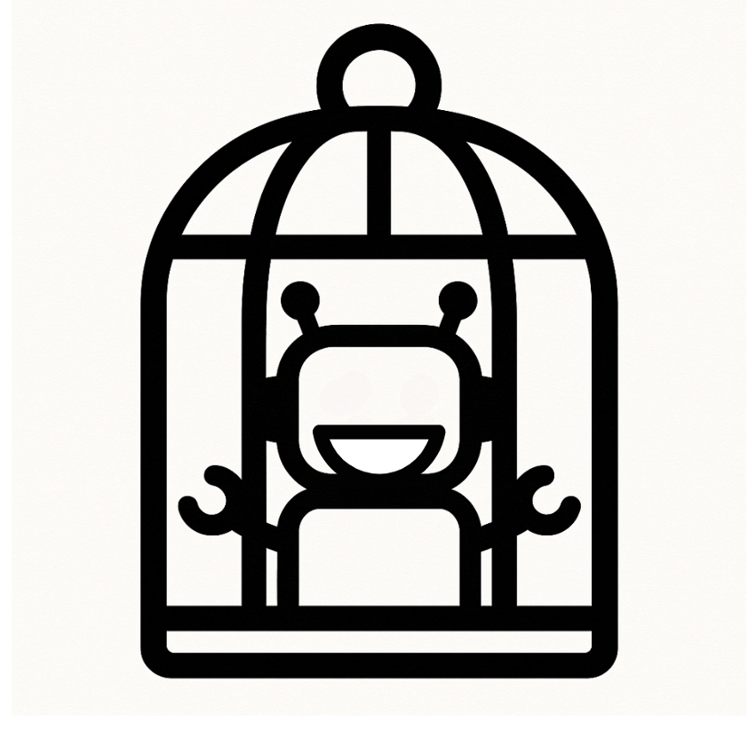{width="600px" fig-align="center"}

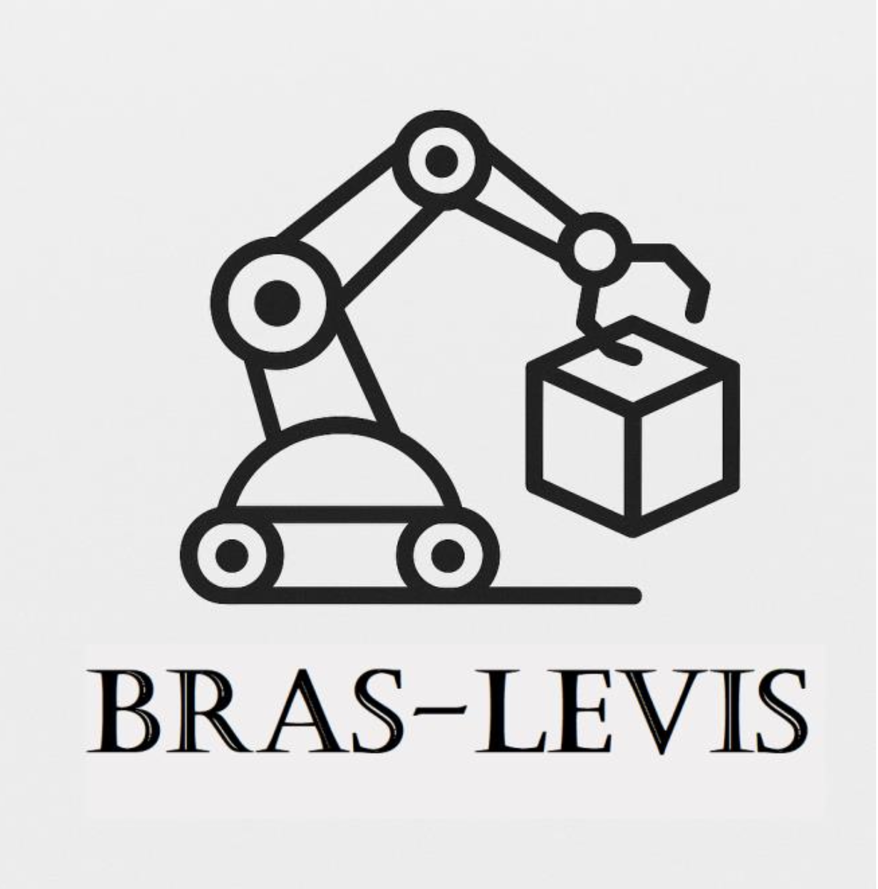{width="600px" fig-align="center"}

:::

## CubeBot Vs. Flash3

:::{layout="[45,-5, 45]" layout-valign="top"}

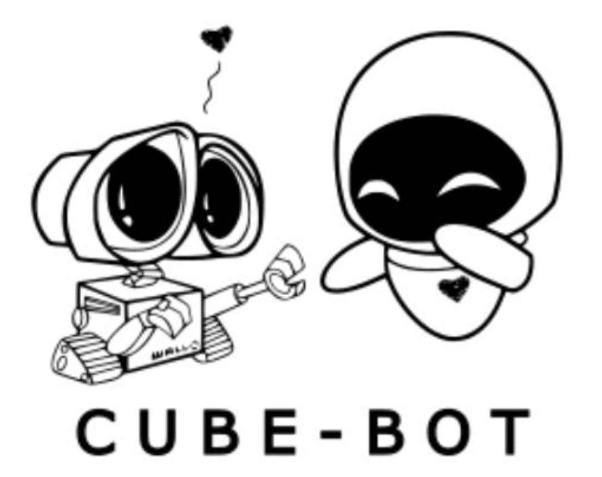{width="600px" fig-align="center"}

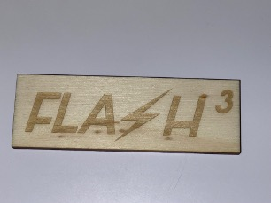{width="600px" fig-align="center"}
:::

:::{layout="[45,-5, 45]" layout-valign="top"}


:::

## CubeBot Vs. Flash3

:::{layout="[45,-5, 45]" layout-valign="top"}

{width="600px" fig-align="center"}
:::

## Ener Vs. 1DIREXION

:::{layout="[45,-5, 45]" layout-valign="top"}

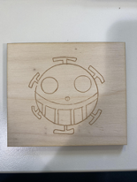{width="600px" fig-align="center"}

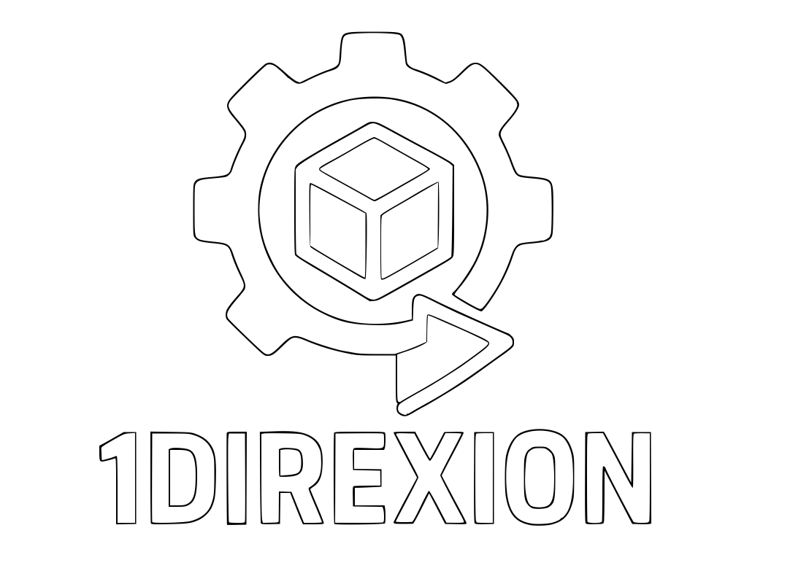{width="600px" fig-align="center"}

:::

## JIM Vs. ARTI CUBE

:::{layout="[45,-5, 45]" layout-valign="top"}

{width="600px" fig-align="center"}

{width="600px" fig-align="center"}

:::
