::: {.callout-tip}
## Objectifs de la séance :

- Identifications des types de laisons mécaniques
- Maitrise des notions théoriques sur la modélisation des mécanismes
- Réalisations d'un schéma cinématique minimal

:::

::: {.callout-warning}
## Démarche

La réalisation d'un schéma cinématique respecte concerne les étapes suivantes: 

1. **Identifications des classes d'equivalence**: Une classe d'équivalence est un groupe de pièces n'ayant aucun mouvement relatif les unes par rapport aux autres pour une phase de fonctionnement donnée. La recherche des classes d'équivalence passe par la localisation de toutes les liaisons encastrement (liaisons complètes) réalisées à l'intérieur du mécanisme pour la phase de fonctionnement étudiée.
2. **Tracé du graph des liaisons**: Un graphe des liaisons (ou graphe de structure), est un graphe représentant les différentes classes d'équivalence (ce sont les noeuds) reliés entre eux par des traits matérialisant les liaisons. 
3. **Réalisations d'un schéma cinématique minimal**
   - Recherche de la géometrie des contacts, et conclusions sur le type de liaisons.
   - Choix d'une vue de répresentation du schéma cinématique (face, gauche, dessus, ...)
   - Répresentation normalisée de ces liaison en cohérence avec la vue choisie
   - Connexion entre-elles des liaisons issues de la même classe d'équivalence.
:::

\newpage

# Réalisations des schémas cinématiques

## Exercice 1

:::{layout="[30,70]" layout-valign="center"}

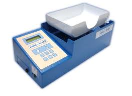{width="100%" fig-align="center"}

:::{}
Cet automate permet de superviser le prélèvement de sang lors de collectes mobiles. Il effectue simultanément la pesée (volume) et l’agitation des poches de sang. 
\newline
Le plateau d’agitation est animé d’un mouvement de rotation alternative autour d’un axe horizontal.
Ce mouvement est provoqué par un motoréducteur qui entraine en rotation un bras, puis transmis au plateau via une bielle.
:::
:::

**Questions:**

::: {.questions}

[]{.question} 
Nommez et identifiez les classes d’equivalence et les liaisons.

:::{layout="[[45,-5,45],[-15],[45,-5,45]]" layout-valign="top"}

:::{}
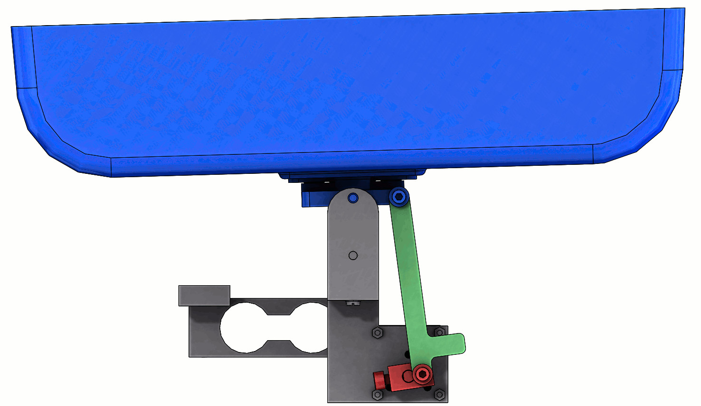{fig-align="center" width="80%"}

\vspace{10pt}
:::

:::{.solutionbox arguments="5cm"}
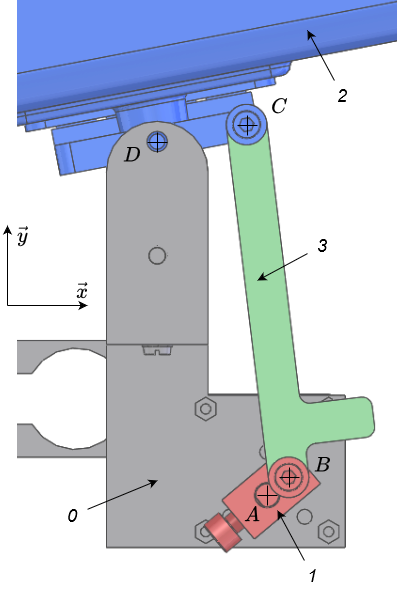{fig-align="center" width="120px"}
:::

:::{}
[]{.question} 
Déterminer le graphe des liaisons du mécanisme (choisir la base pour orienter l’espace, et les différents points nécessaires à la description des liaisons)

:::{.solutionbox arguments="5cm"}
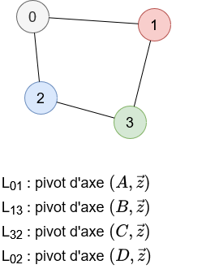{fig-align="center" width="130px"}

:::
:::

:::{ }
[]{.question} 
Réaliser le schéma cinématique dans le plan de l’animation précédente.

:::{.solutionbox arguments="6cm"}

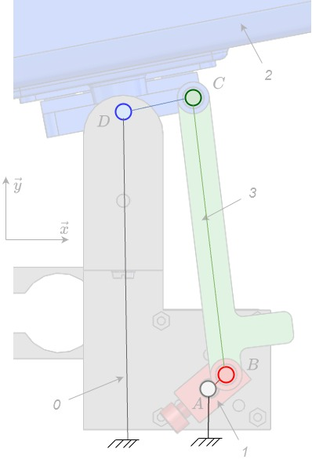{fig-align="center" width="130px"}

:::

:::
:::
:::

\newpage

## Exercice 2

::: {.questions}
[]{.question} 
Colorier les pièces en fonction de leur classe d’équivalence

:::{layout="[[30,70],[45,-5,45]]" layout-valign="center"}

:::{}
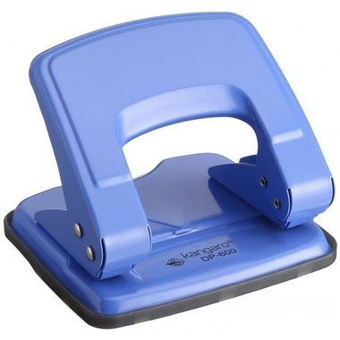{fig-align="center" width="80%"}
:::

:::{}
{fig-align="center" width="400px"}
\vspace{10pt}

:::

:::{}
[]{.question} 
Déterminer le graphe des liaisons du mécanisme

:::{.solutionbox arguments="9cm"}

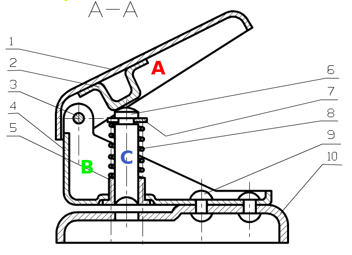{fig-align="center" width="100%"}

:::
:::

:::{}
[]{.question} 
**Tracez le schéma cinématique**

:::{.solutionbox arguments="9cm"}

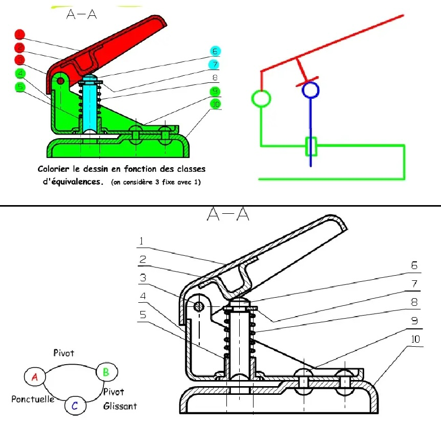{fig-align="center" width="100%"}

:::
:::

:::

:::

\newpage

## Exercice 3

::: {.questions}
[]{.question} 
Colorier les pièces en fonction de leur classe d’équivalence

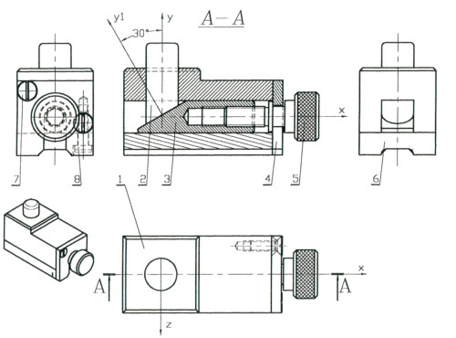{width="80%" fig-align="center"}

:::{layout="[[45,-5,45]]" layout-valign="center"}

:::{}
[]{.question} 
Tracez le graphe des liaisons.

:::{.solutionbox arguments="9cm"}
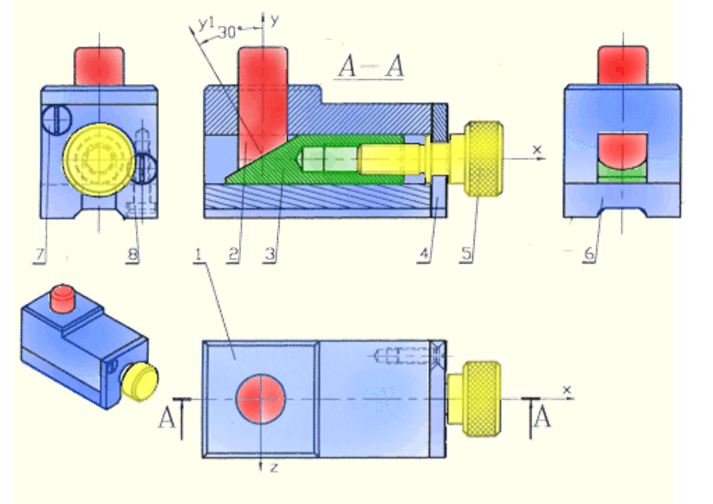{width="80%" fig-align="center"}
:::
:::

:::{}
[]{.question} 
**Tracez le schéma cinématique**

:::{.solutionbox arguments="9cm"}
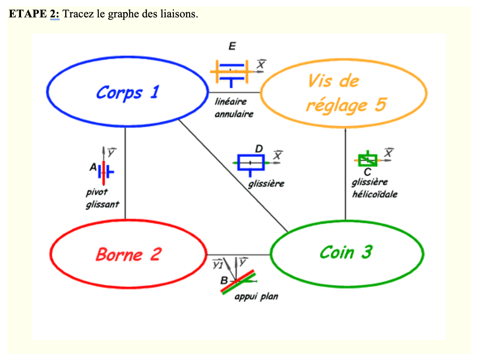{width="80%" fig-align="center"}

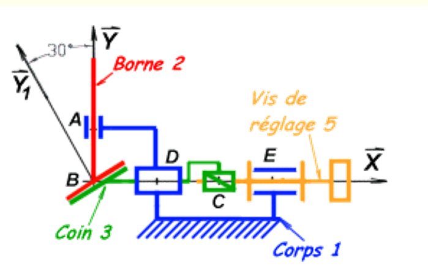{width="80%" fig-align="center"}
:::
:::

:::

:::

\newpage

## Exercice 4

:::{layout="[30,70]" layout-valign="center"}

{width="150px" fig-align="top"}

:::{}
Cette bride a pour fonction le matine d'une pièce pendant une opération d'usinage. Le fluide sous préssion est injecté dans l'orifice d'admision. 

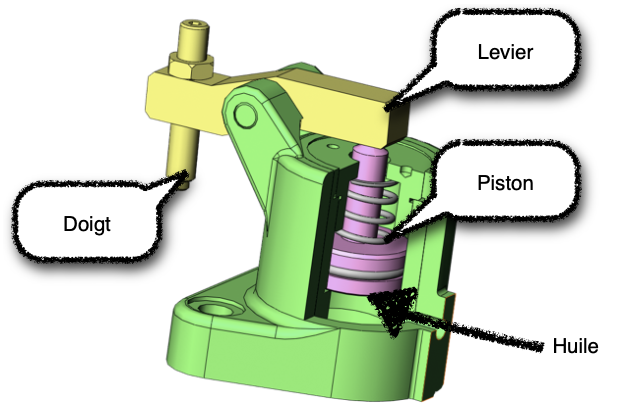{width="300px" fig-align="center"}
:::
:::

:::{.questions}

[]{.question} 
Identifier les classes d'equivalence à l'aide de couleurs distintes.Tracé le Graphe des Liaisons et le schéma cinématique.

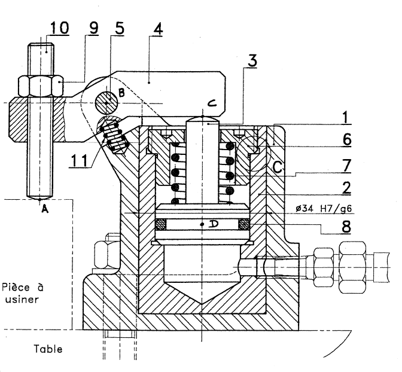{width="80%" fig-align="center"}

:::{layout="[30,-5,70]"}

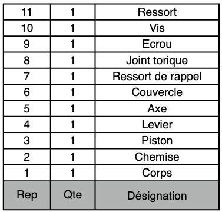{width="100%" fig-align="center"}

:::{.solutionbox arguments="8cm"}

**Classes d'équivalence cinématique**

- \textcolor{blue}{$A: \{1,2,5,6 \} $ Bâti }
- \textcolor{red}{$B: \{ 3 \} $ Piston }
- \textcolor{green}{$C: \{ 4,9,10 \} $ Levier }
- \textcolor{yellow}{$D: $ Pièce à usiner }

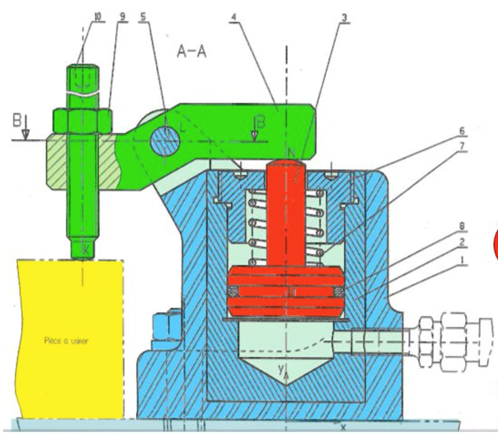{fig-align="left" width="200px"}

Ressort et joint sont à exclure car il sont déformable.
:::

:::

:::{layout="[45,-5,45]" layout-valign="center"}

:::{.solutionbox arguments="9cm"}

**Graph des liaisons:**
 

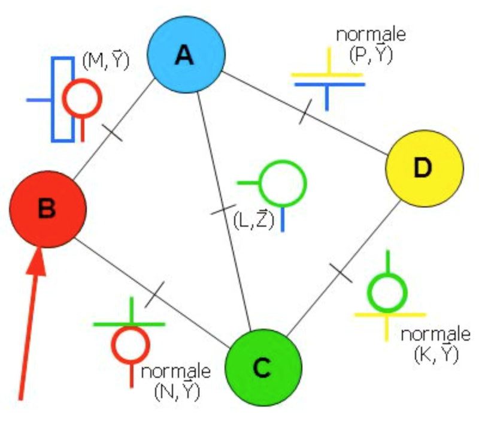{fig-align="center" width="200px"}

:::

:::{.solutionbox arguments="9cm"}

Schéma cinématique
 
 

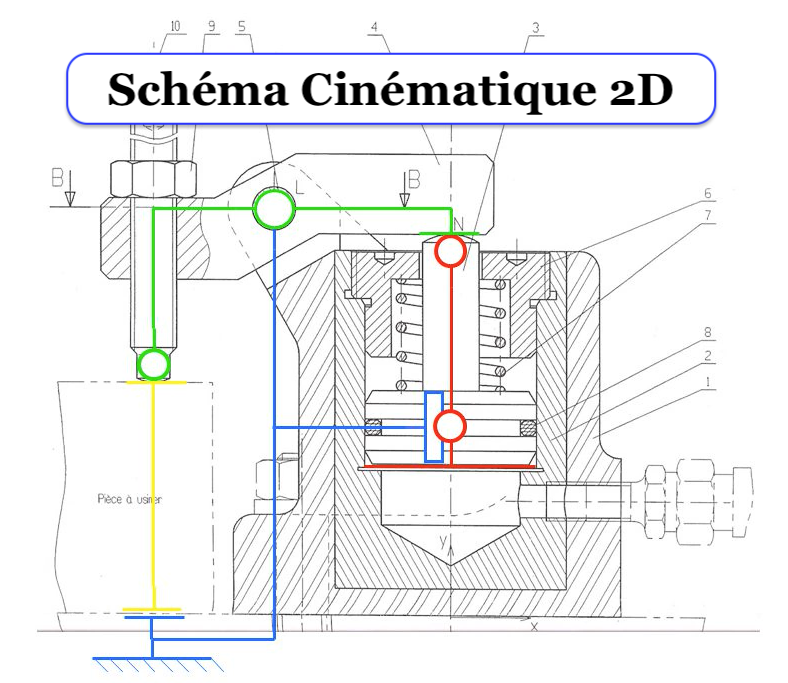{fig-align="center" width="280px"}
:::

:::

:::

\newpage

## Exercice 5

:::{layout="[45,-5,50]" layout-valign="center"}

:::{}
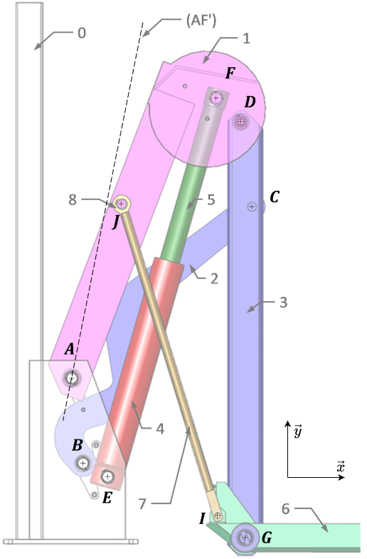{fig-align="center"}
:::

:::{}

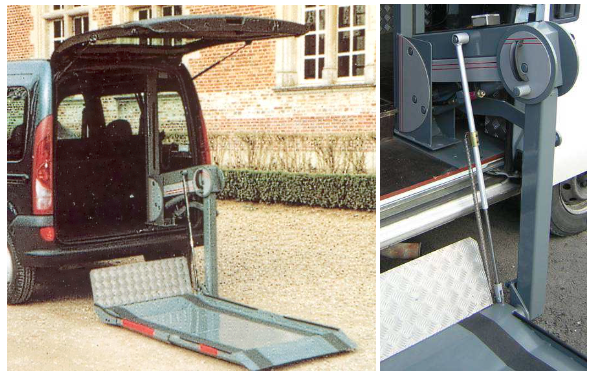{width="100%" fig-align="center"}

La société Bourgeois fabrique et commercialise des hayons élévateurs permettant l’accès d’un véhicule à toute personne se déplaçant en fauteuil roulant, sans modification de la carrosserie.

{width="100%" fig-align="center"}
:::
:::

::: {.questions}

[]{.question} 
Réaliser le graphe des liaisons de ce mécanisme, en phase de montée (en décrivant complètement les différentes liaisons).   

:::{.solutionbox arguments="7cm"}
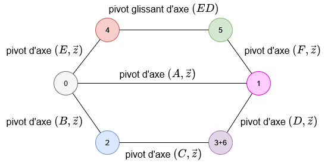{width="70%" fig-align="center"}
:::

[]{.question}
Réaliser le schéma cinématique 

:::{.solutionbox arguments="9cm"}
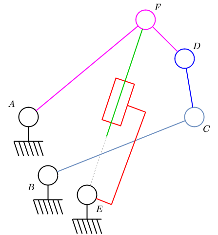{width="40%" fig-align="center"}
:::

:::

