# 🎯 But de la Séance de TP {.unummered}

1. Concevoir un ***modèle d'assemblage***.  
2. Faire une **simulation de mouvement** d'un modèle CAO

# Etapes pour faire une assemblage

::: {layout="[60,40]"}

:::{}
1. [Inserer les pièces](#inserer)
2. [Établir une pièce fixe de Réference.](#ref)
3. [Determiner les liaison](#liasons)
4. [Etablier les limites](#limites)
5. [Faire les simulation de mouvement](#simulation)
:::

:::{.callout-tip title="Aide d'Onshape"}

📢 Nous allons regarder le [Manuel d'aide d'Onshape.](https://cad.onshape.com/help/fr_FR/Content/assembly.htm?TocPath=Assemblages%7C_____0)

N'hesites pas à le regarder en détail ⚠️

:::

:::
## Insérer les pièces {#inserer}

::: {layout="[30,60]"}

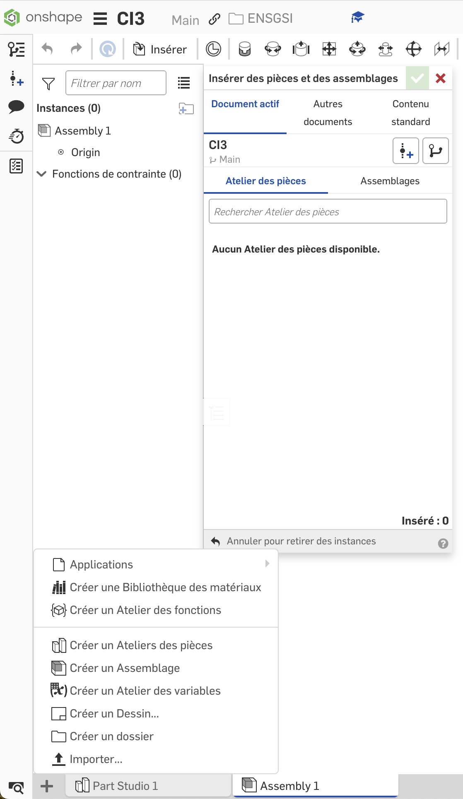{width="400px" fig-align="center"}

:::{}

- `Onglet > Créer un Assemblage`
- **Insérer**
   - Documents Actif
   - Autres documents
   - Contenu Standard

:::
:::

## Établir une pièce fixe de Réference {#ref}

::: {layout="[30,60]"}
:::{}
1. Établir la prèmiere pièce à l'origine de l'assemblage.
2. Fixer la pièce
:::

:::{}
[{width=80% fig-align="center"}
](https://learn.onshape.com/learn/course/fundamentals-onshape-assemblies/creating-an-assembly/moving-your-first-part-to-the-origin?page=1&wvideo=rn2b2zw9nl){target="_blank"}
:::
:::

## Déterminer les Liasons {#liasons}

Deux elements importantes:

1. Connecteur de positionnement 📍.
2. Établissement des liaisons entre chaque couples de pièces 🔗.  

### Connecteur de posionnement

::: {layout="[30,60]"}

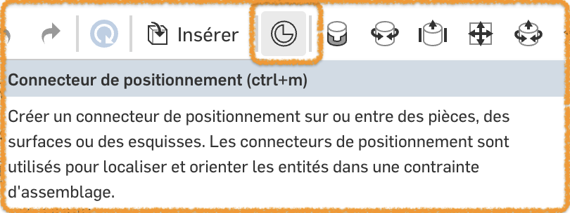{fig-align="center"}

[{width=80% fig-align="center"}
](https://cad.onshape.com/help/fr_FR/Content/mateconnector_a.htm#Video){target="_blank"}

:::

### Rappels de théorie

#### 0 Degres de Liberté: Encastrement

::: {layout="[30,70]"}
:::{}

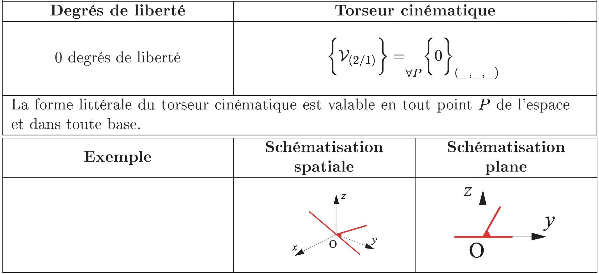{.lightbox width="80%" fig-align="center"}

{width="300px" fig-align="center"}

:::

:::{}

[{width=80% fig-align="center"}
](https://cad.onshape.com/help/fr_FR/Content/mate-fastened.htm#video-example){target="_blank"}

:::
:::

### 1 Degré de Liberté: Pivot & Glissière

::: {.panel-tabset}

#### Pivot 

::: {layout="[30,70]"}
:::{}
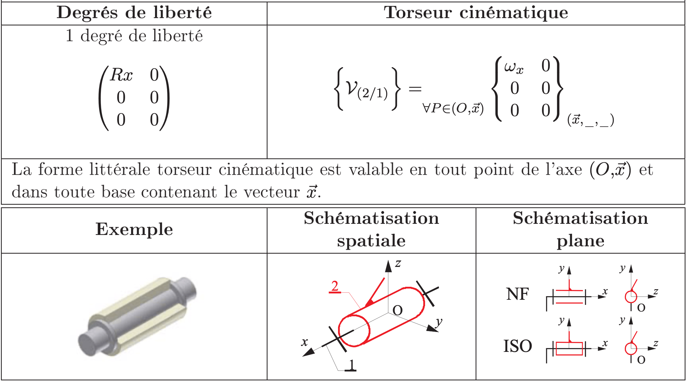{.lightbox width="70%" fig-align="center"}

{width="300px" fig-align="center"}
:::

[{width=80% fig-align="center"}
](https://cad.onshape.com/help/fr_FR/Content/mate-revolute.htm#video-example){target="_blank"}

:::

#### Glissière

::: {layout="[30,70]"}
:::{}
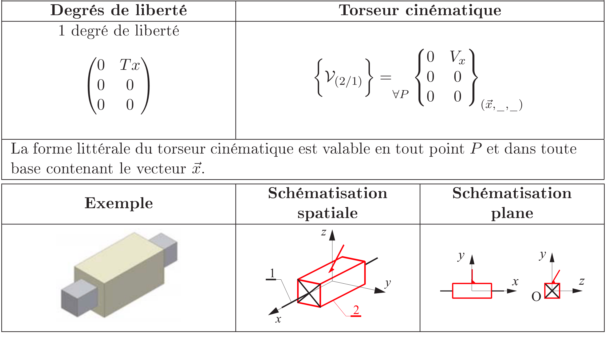{.lightbox width="70%" fig-align="center"}

{width="300px" fig-align="center"}
:::

[{width=80% fig-align="center"}
](https://cad.onshape.com/help/fr_FR/Content/mate-slider.htm#video-example){target="_blank"}

:::
:::

### 2 Degrés de liberté: Pivot glissant & Ranure

::: {.panel-tabset}

#### Pivot glissant

::: {layout="[30,70]"}
:::{}

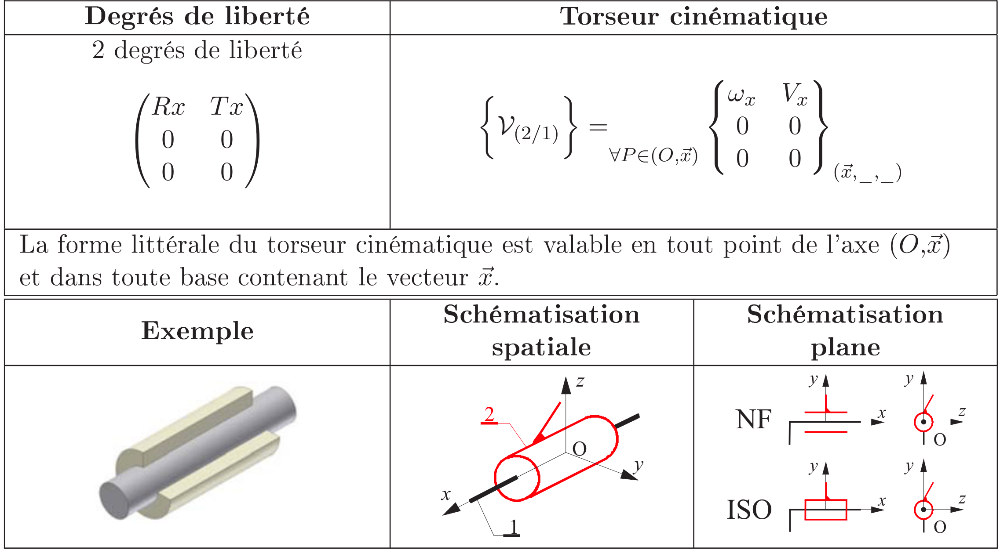{width="70%" fig-align="center" .lightbox}

{width="70%" fig-align="center"}
:::
:::{}

[{width=80% fig-align="center"}
](https://cad.onshape.com/help/fr_FR/Content/mate-cylindrical.htm#video-example){target="_blank"}

:::
:::

#### Ranure

::: {layout="[30,70]"}

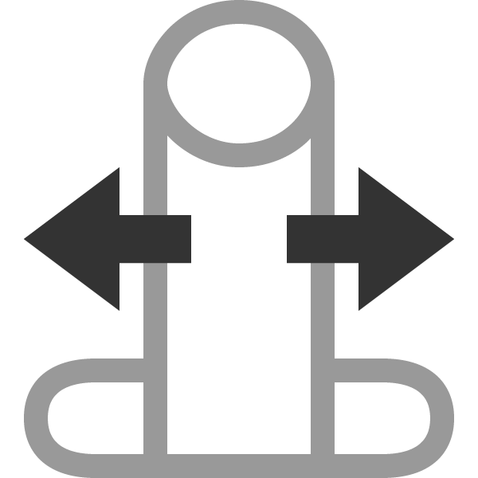{width="70%" fig-align="center"}

[{width=80% fig-align="center"}
](https://cad.onshape.com/help/fr_FR/Content/mate-pin_slot.htm#video-example){target="_blank"}

:::

:::

### 3 Degrés de liberté : Appui-Plan & Rotule

::: {.panel-tabset}

#### Appui plan

::: {layout="[30,70]"}
:::{}
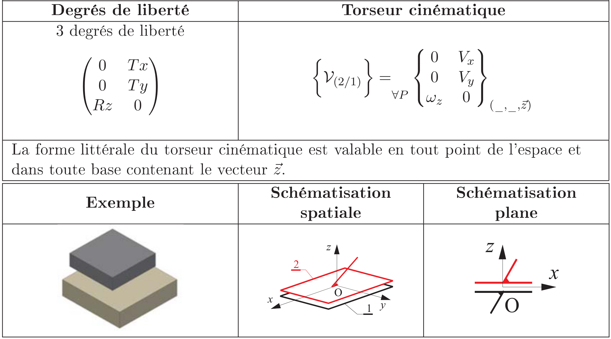{.lightbox width="70%" fig-align="center"}

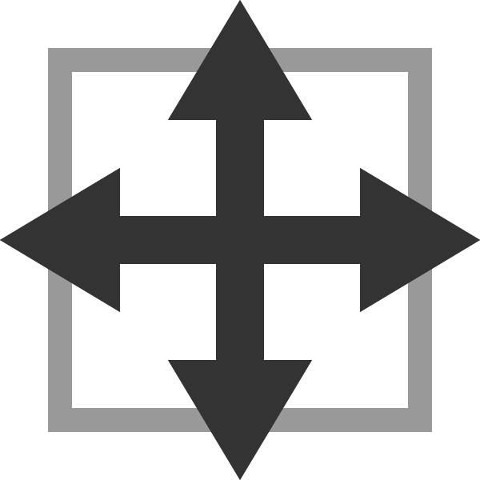{width="70%" fig-align="center"}
:::

[{width=80% fig-align="center"}
](https://cad.onshape.com/help/fr_FR/Content/mate-planar.htm#video-example){target="_blank"}

:::

#### Rotule

::: {layout="[30,70]"}
:::{}
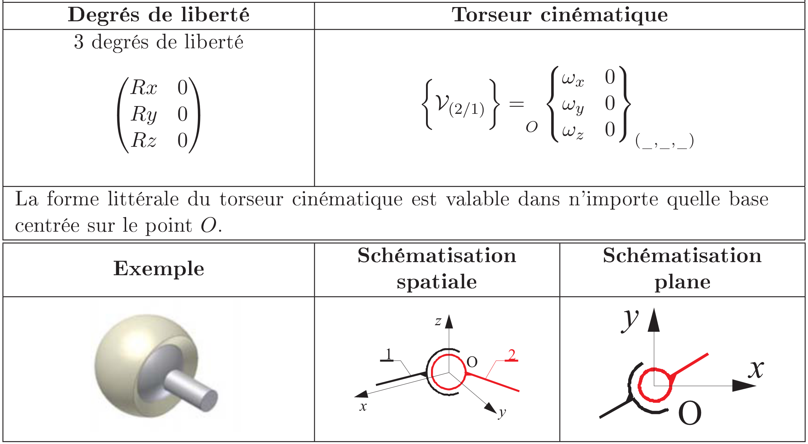{.lightbox width="70%" fig-align="center"}

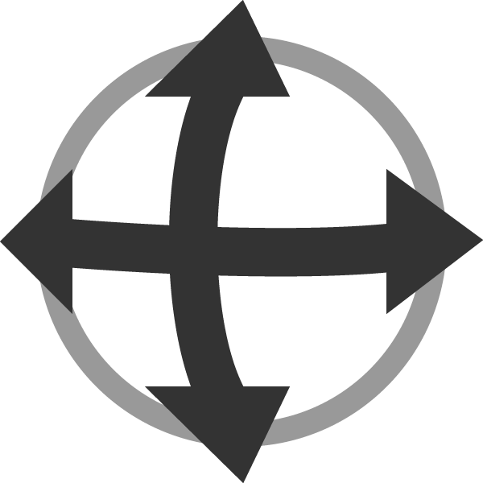{width="70%" fig-align="center"}
:::

[{width=80% fig-align="center"}
](https://cad.onshape.com/help/fr_FR/Content/mate-ball.htm#video-example){target="_blank"}

:::
:::

### Additionnels : Parallèle & Tangent

::: {.panel-tabset}

#### Parallèle

::: {layout="[30,70]"}
:::{}

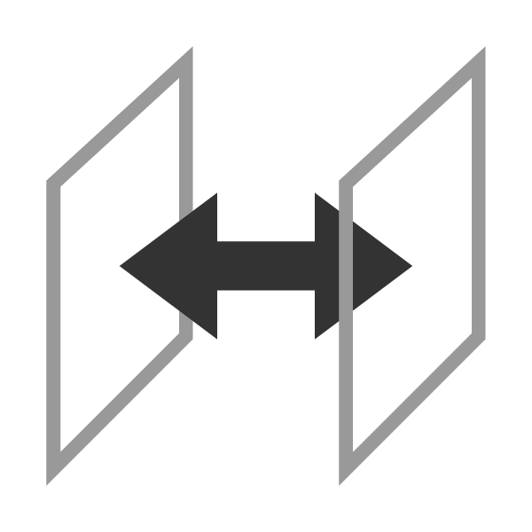{width="70%" fig-align="center"}
:::

[{width=80% fig-align="center"}
](https://cad.onshape.com/help/fr_FR/Content/parallelmate.htm#Video){target="_blank"}

:::

#### Tangente

[{width=80% fig-align="center"}
](https://cad.onshape.com/help/fr_FR/Content/mate-tangent.htm#video-example){target="_blank"}

:::

## Établier les limites & Simulation {#limites}

::: {layout="[40,60]"}

:::{}
1. Identifiez les types liaisons.
2. Espécifiez des limites pour chaque axes traslation/rotation
3. Simulez le mouvement elementaire de chaque liaison
:::

[{width=80% fig-align="center"}
](https://learn.onshape.com/learn/course/fundamentals-onshape-assemblies/mating-assembly-components/onshape-mating?page=1&wvideo=h1h5cz7jry){target="_blank"}

:::

# Exercices 

::: {layout="[25,25, 25, 25]"}
::: {}
**Ex. 1**

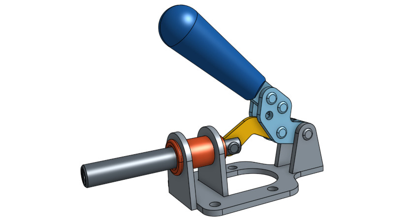{width="90%" fig-align="center"} 

Tutoriel de base
:::
::: {}
**Ex. 2**
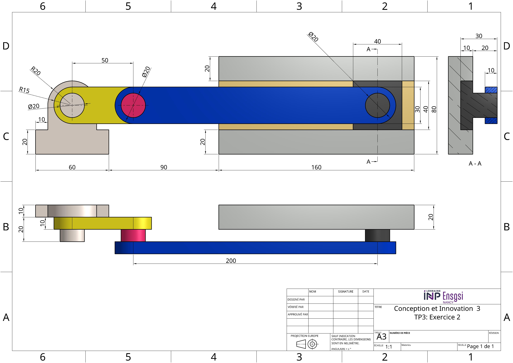{.lightbox width="90%" fig-align="center"} 
:::
::: {}
**Ex. 3**

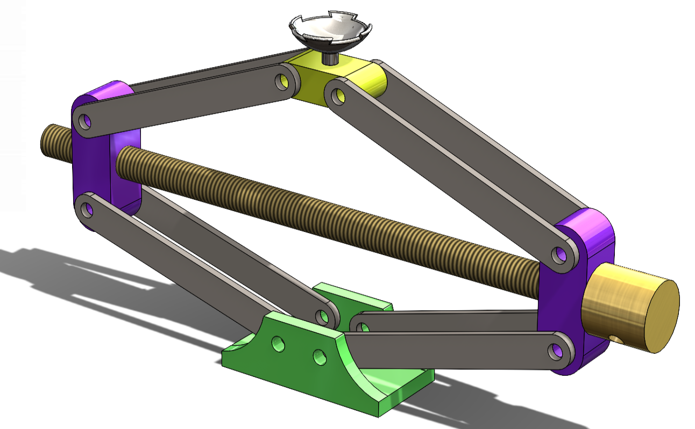{width="50%" fig-align="center"} 

:::
::: {}
**Ex. 4**
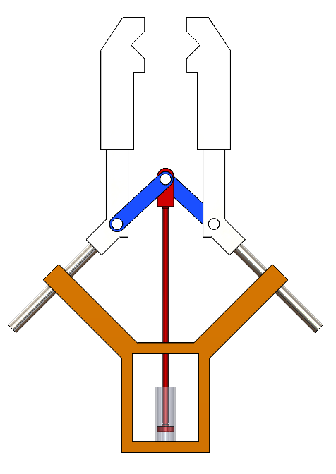{width="100%" fig-align="center"} 
:::
:::

## Exercice 1

**But:** Faire le tutoriel proposé par onshape sur comment créer des assemblages. 

::: {layout="[30, 70]" layout-valign="center"}
::: {}

[Lien pour le tutoriel](https://learn.onshape.com/learn/course/fundamentals-onshape-assemblies/mating-assembly-components/exercise-basic-assembly?page=1){target="_blank"}

:::

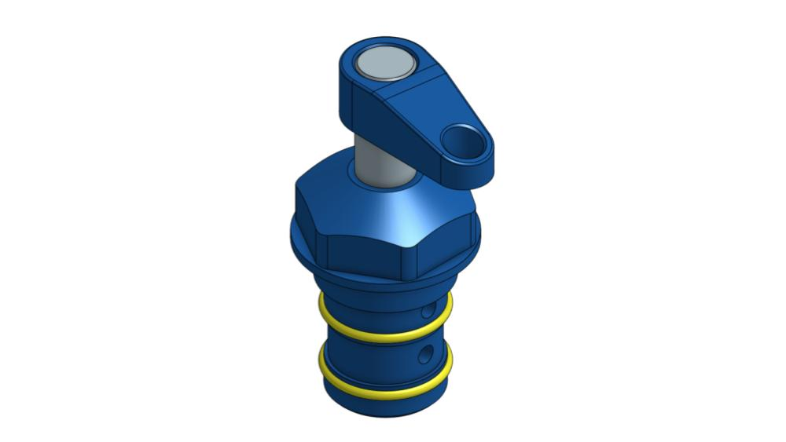{width="100%" fig-align="center"} 
:::

## Exercice 2

:::{layout="[30, 70]" layout-valign="center"}
::: {}
**But**: 

1. Modéliser les pièces
2. Construire  le ***modèle d'assemblage***. 
3. Faire la simulation
:::

{.lightbox width="65%" fig-align="center"} 

:::

### Simulation Exercice 1



## Exercice 3

**But**: 
Concevoir un ***modèle d'assemblage***. 

### Exercice 2

**But:** Faire les differents pièces et après faire la simulation de mouvement. 

::: {layout="[30, 70]" layout-valign="center"}
::: {}

[⬇️ Téléchargez le dessin technique](TP3/Ex2/Ex2.pdf){width="65%" fig-align="center"} 

:::

{width="100%" fig-align="center"} 
:::

## Exercice 3

**But**: 
Concevoir un ***modèle d'assemblage***. 

### Exercice 3

**But:** Faire les differents pièces et après faire la simulation de mouvement. 

::: {layout="[30, 70]" layout-valign="center"}
::: {}

[⬇️ Téléchargez le dessin technique](TP3/Ex3/Ex3.pdf)



:::
{width="50%" fig-align="center"} 
:::

# Bonus

## Exercice Bonus

::: {layout="[30, 70]" layout-valign="center"}
::: {}

[⬇️ Téléchargez le dessin technique](TP3/Ex6/Ex.6.png)



:::
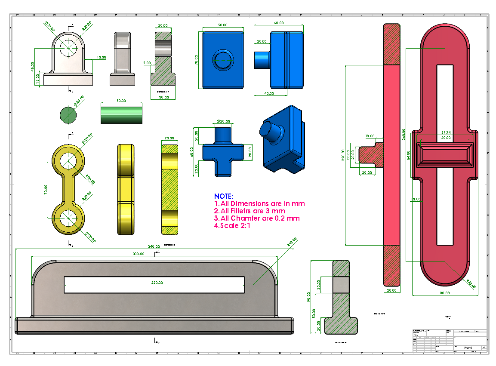{width="60%" fig-align="center"}
:::

