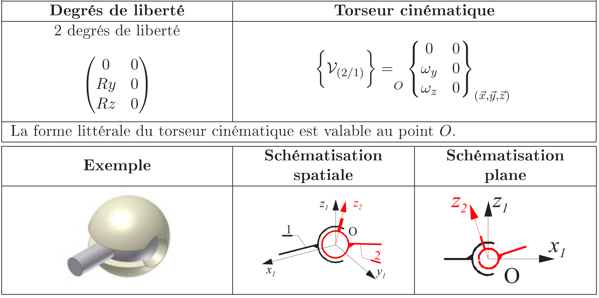
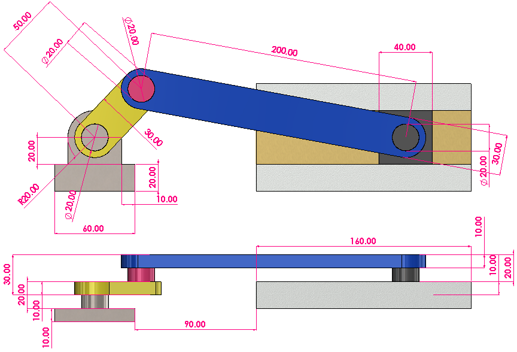
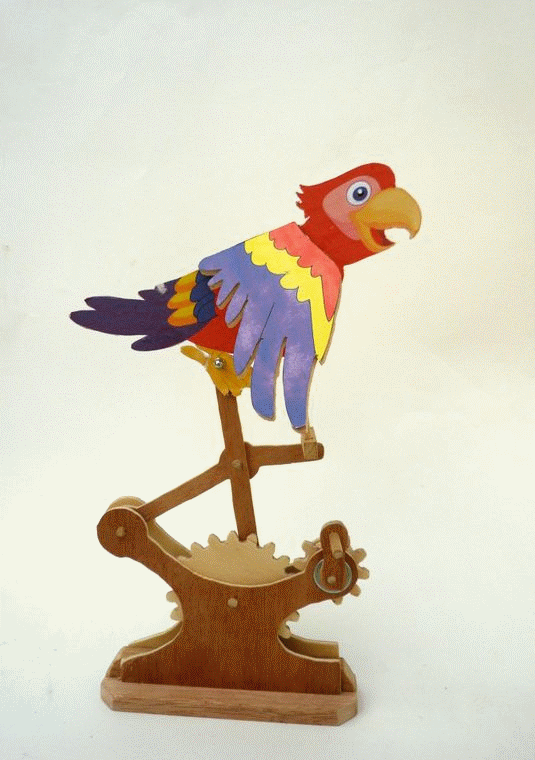

# 🎯 But de la Séance de TP {.unummered}

1. Concevoir un ***modèle d'assemblage***.  
2. Faire une **simulation de mouvement** d'un modèle CAO

# Etapes pour faire une assemblage

::: {layout="[60,40]"}

:::{}
1. [Inserer les pièces](#inserer)
2. [Établir une pièce fixe de Réference.](#ref)
3. [Determiner les liaison](#liasons)
4. [Etablier les limites](#limites)
5. [Faire les simulation de mouvement](#simulation)
:::

:::{.callout-tip title="Aide d'Onshape"}

📢 Nous allons regarder le [Manuel d'aide d'Onshape.](https://cad.onshape.com/help/fr_FR/Content/assembly.htm?TocPath=Assemblages%7C_____0)

N'hesites pas à le regarder en détail ⚠️

:::

:::
## Insérer les pièces {#inserer}

::: {layout="[40,60]"}

:::{}

- `Onglet > Créer un Assemblage`
- **Insérer**
   - Documents Actif
   - Autres documents
   - Contenu Standard

:::
:::

## Établir une pièce fixe de Réference {#ref}

### Connecteur de posionnement

{fig-align="center"}

[{width=80% fig-align="center"}
](https://cad.onshape.com/help/fr_FR/Content/mateconnector_a.htm#Video)

## Déterminer les Liasons {#liasons}

### Rappels de théorie

#### 0 Degres de Liberté: Encastrement

::: {.panel-tabset}

##### Liaison Encastrement

{width="80%" fig-align="center"}

##### Encastrement sous Onshape

::: {layout="[30,70]"}
:::{}

::: {.callout-tip}
📢 Regardes l'aide du logiciel Onshape pour mieux comprendre !
:::

:::
:::{}

<a href="https://cad.onshape.com/help/Content/mate-fastened.htm?wvideo=w8fodmuokg#video-example">Plus de détails</a>

:::
:::

:::

### 1 Degré de Liberté: Pivot & Glissière

::: {.panel-tabset}

#### Pivot 
{width="70%" fig-align="center"}

#### Pivot sous Onshape

::: {layout="[30,70]"}

:::{}

<a href="https://cad.onshape.com/help/Content/mate-slider.htm?TocPath=Assemblies%7CMates%7C_____3&wvideo=c2kawndkjz#">Slider-mate</a>

:::
:::

#### Glissière
{width="70%" fig-align="center"}

#### Glissière sous Onshape

::: {layout="[30,70]"}
:::{}

:::
:::{}

:::
:::

:::

### 2 Degrés de liberté 

::: {.panel-tabset}

#### Pivot glissant
{width="70%" fig-align="center"}

#### Rotule à doigt
{width="70%" fig-align="center"}
:::

### 3 Degrés de liberté 

::: {.panel-tabset}

#### Appui plan
{width="70%" fig-align="center"}

#### Rotule
{width="70%" fig-align="center"}
:::

## Interface Onshape

### Notion de Liasons

## Exercices Individueles des Liasons.

::: {layout="[30,70]"}
:::{}
 liasion fxe

- 0 degrees de liberté
- Selectioner entr

:::

:::{}



:::
:::

## Établier les limites {#limites}

## Faire les simulation de mouvement {#simulation}

## Exercices Liason Pivot

# Exercices 

::: {layout="[[25,25, 25, 25], [20, 30, 50]]"}
::: {}
**Ex. 0**

{width="90%" fig-align="center"} 

Tutoriel de base
:::
::: {}
**Ex. 1**
{width="90%" fig-align="center"} 
:::
::: {}
**Ex. 2**

{width="50%" fig-align="center"} 

:::
::: {}
**Ex. 3**
{width="100%" fig-align="center"} 
:::
::: {}
:::
::: {}
**Logiciel**:
:::
::: {}
](TP1/Onshape-logo.png){width="40%" fig-align="left"}
:::
:::

## Exercice 0

**But:** Faire le tutoriel proposé par onshape sur comment créer des assemblages et à travailleur avec eux. 

::: {layout="[30, 70]" layout-valign="center"}
::: {}

[Lien pour le tutoriel](https://learn.onshape.com/courses/fundamentals-onshape-assemblies)

:::

{width="100%" fig-align="center"} 
:::

## Exercice 1

**But**: 
Concevoir un ***modèle d'assemblage***. 

### Exercice 1

**But:** Faire les differents pièces et après faire la simulation de mouvement. 

{width="65%" fig-align="center"} 

### Simulation Exercice 1



## Exercice 2

**But**: 
Concevoir un ***modèle d'assemblage***. 

### Exercice 2

**But:** Faire les differents pièces et après faire la simulation de mouvement. 

::: {layout="[30, 70]" layout-valign="center"}
::: {}

[⬇️ Téléchargez le dessin technique](TP3/Ex2/Ex2.pdf){width="65%" fig-align="center"} 

:::

{width="100%" fig-align="center"} 
:::

## Exercice 3

**But**: 
Concevoir un ***modèle d'assemblage***. 

### Exercice 3

**But:** Faire les differents pièces et après faire la simulation de mouvement. 

::: {layout="[30, 70]" layout-valign="center"}
::: {}

[⬇️ Téléchargez le dessin technique](TP3/Ex3/Ex3.pdf)



:::
{width="50%" fig-align="center"} 
:::

# Bonus

## Exercice Bonus

::: {layout="[30, 70]" layout-valign="center"}
::: {}

[⬇️ Téléchargez le dessin technique](TP3/Ex6/Ex.6.png)



:::
{width="60%" fig-align="center"}
:::

## Exercice Bonus II

{width="40%" fig-align="center"}

