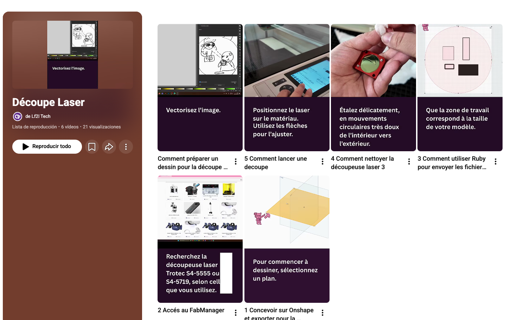
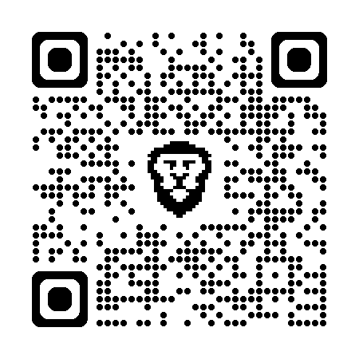
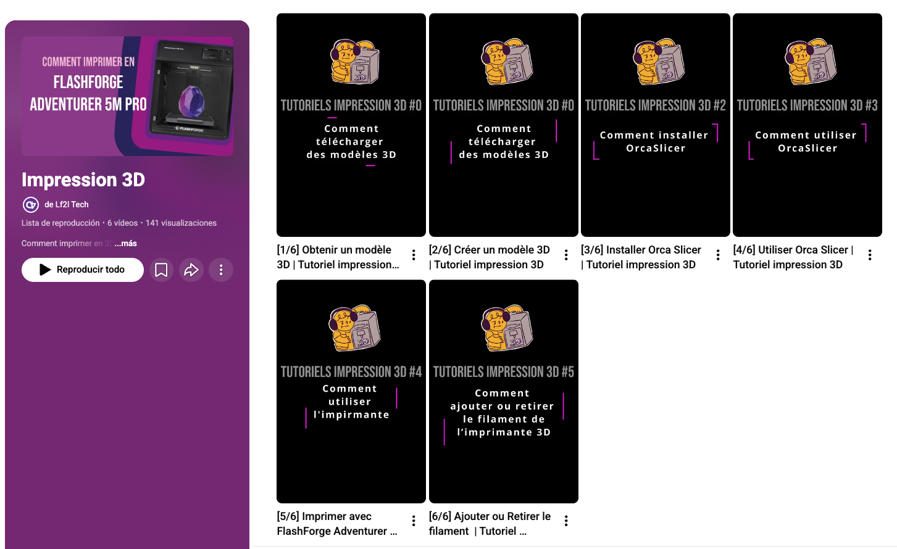
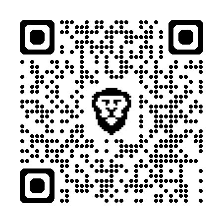

\thispagestyle{fancy}

::: {.callout-tip}
# Le but de la Séance est:

1. Définir le problème de conception.
1. Réaliser l’analyse fonctionnelle et établir le cahier des charges.
1. Effectuer un benchmark des concepts de solution possibles.
1. Se familiariser avec les outils du LF2L.

:::

# Description de la Séance

Chaque séance de travaux pratiques (TP) comporte des objectifs spécifiques à atteindre. 
Les résultats produits lors de chaque séance constituent des *Objets Intermédiaires de Conception* (OIC).
Au fur et à mesure du projet, vous devrez documenter ces OIC sur le portail, à l’issue de chaque séance, via :

- [Fabmanager du LF2L - https://fabmanager.lf2l.fr/ ](https://fabmanager.lf2l.fr/).

À la fin du projet, cette fiche constituera une synthèse de votre analyse ainsi que de votre proposition de concept pour le mécanisme (ou système) développé dans le cadre du projet CI3.

## Activités à Réaliser

1. **Définir un nom d’équipe**.
1. **Analyse fonctionelle**: 

   1. Définir précisément le Problème de Conception. 
   1. Identifier les fonctions du système (Diagramme Pieuvre).
   1. Décomposer les fonctions globales en sous-fonctions techniques et les associér à chaque concept, et les caractériser.
   1. Identifier au moins trois concepts de solution (architectures techniques) pertinents pour votre projet.
   1. Représenter le système envisagé à l’aide d’un schéma simple, accompagné d’une description de son fonctionnement.

1. **Materialisation**:

    1. Chaque membre doit concevoir un prototype de logo (voir tutoriels ci-dessous), en utilisant des techniques de dessin à la main et/ou de conception assistée par ordinateur (CAO).

    2. Chaque équipe doit réaliser un cube de dimensions 30 × 30 × 30 mm en impression 3D, avec les paramètres suivants :

        - Taux de remplissage : 30 %
        - Motif : rectiligne

1. **Documentation du Projet** :

   - Chaque équipe doit créer un espace projet sur le portail Fabmanager afin de documenter l’avancement du projet à chaque séance de TP. Veillez à le configurer en mode « Brouillon ».

   - Documentez les points **Analyse fonctionelle** et **Matérialisation** de la séance d'aujourd'hui.

\newpage

## Tutoriels

:::{layout="[70,-5, 25]"}

{fig-align="center"}

{fig-align="center"}

{fig-align="center"}

{fig-align="center"}

:::