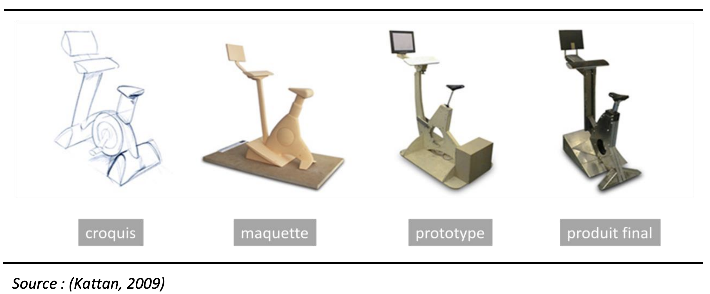
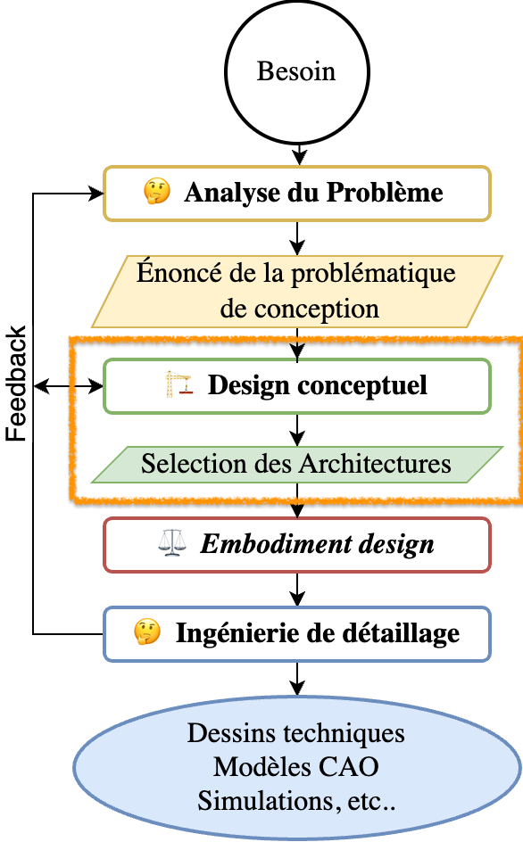

::: {.callout-tip}

## Objectif de la Séance

**Chaque groupe doit concevoir, fabriquer et documenter *un prototype de basse fidélité* pour votre projet.**   
La documentation sera faite sur le portail [Fabmanager du LF2L - https://fabmanager.lf2l.fr/ ](https://fabmanager.lf2l.fr/)
:::

# Prototypage de Basse fidelité.

Le prototypage basse fidélité (low-fidelity prototyping) consiste à représenter une solution de manière simple, rapide et peu coûteuse, sans chercher la précision technique.
Par example: 1) croquis papier, 2) schémas fonctionnels, 3)
maquettes simplifiées, et 4) simulations basiques.

Il constitue un élément-clé du développement itératif, dans lequel la construction
du produit s’élabore à partir du développement et de l’évaluation de versions
successives du produit, testées et améliorées en fonction des remarques et réactions des utilisateurs et de test de validation.

:::{layout="[70,-5,30]"}

{width="500px" fig-align="center"}

{width="150px" fig-align="center"}

:::

Nous sommes actuellement dans la phase de *design conceptuel*, qui constitue une étape initiale du processus de conception en ingénierie. 
L’idée centrale dans cette séance de TP est
**tester des concepts, pas construire un produit final**.

Durant cette phase, les idées sont générées, explorées et structurées afin de répondre à un besoin clairement identifié. Elle vise à définir les principes fondamentaux d’une solution, sans entrer dans des détails techniques approfondis, tout en intégrant les contraintes, les fonctions attendues et les usages envisagés.

Le prototypage dans un processus de conception itératif, poursuit plusieurs objectifs [@camburn2017; @baccino2009] :

1. Visualiser l’interface et simuler le comportement des fonctionnalités.

2. Communiquer, partager un même langage avec les parties prenantes (équipe de conception, développeurs, commanditaires, utilisateurs).

3. Stimuler la production d’idées.

4. Économiser du temps et de l’argent (vs. passer des mois à développer un ceoncept non adapté aux utilisateurs)

5. Permettre aux utilisateurs cibles de visualiser et de tester le comportement du prototype en menant une recherche utilisateurs. 

## Objectif

À l’issue de cette séance, **vous devrez concevoir, fabriquer et documenter sur [Fabmanager du LF2L - https://fabmanager.lf2l.fr/ ](https://fabmanager.lf2l.fr/) un prototype de basse fidélité** pour votre projet (en taille réelle si possible). 
Ces prototypes doivent vous permettre d’explorer différentes approches de solution.

1. Décrivez votre prototype en identifiant ses composants principaux ainsi que les liaisons mécaniques envisagées. Explicitez, avec le plus de précision possible, la chaîne d’actions (ou chaîne fonctionnelle) que ce concept devrait suivre pour accomplir le défi proposé.

2. Votre prototype intègre-t-il une stratégie dite défensive ? Si oui, décrivez clairement son fonctionnement et son rôle dans le système.

3. Hypothèses mécaniques / electroniques : Quelles hypothèses formulez-vous concernant le fonctionnement mécatronique du prototype ? Précisez les conditions nécessaires pour que votre concept fonctionne comme prévu.

4. Limites et contraintes : Quelles sont les principales limites ou faiblesses de votre concept ? Quelles contraintes techniques ou pratiques devez-vous prendre en compte pour la suite du projet ? Proposez, si possible, des pistes de solutions pour les surmonter.

5. Quelles améliorations envisagez-vous pour la prochaine version de votre prototype ?

## References

