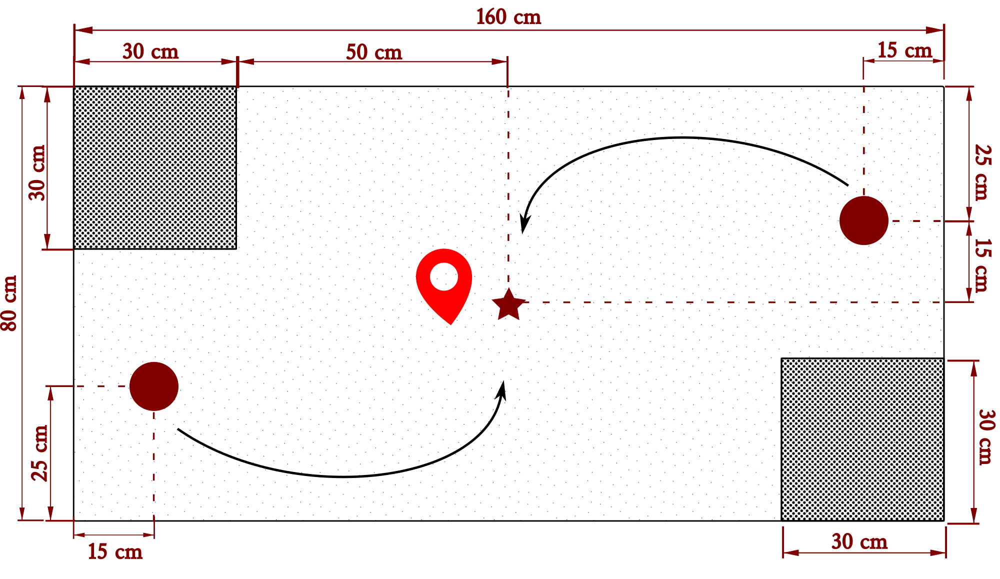
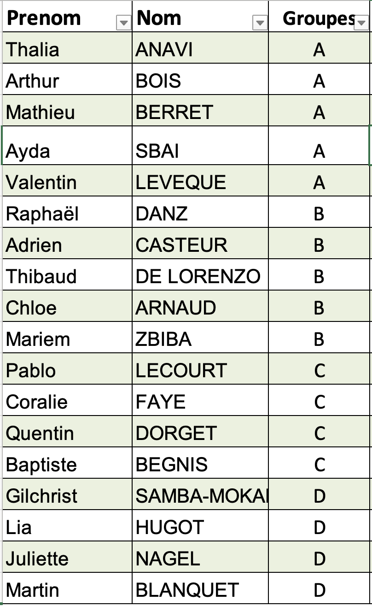
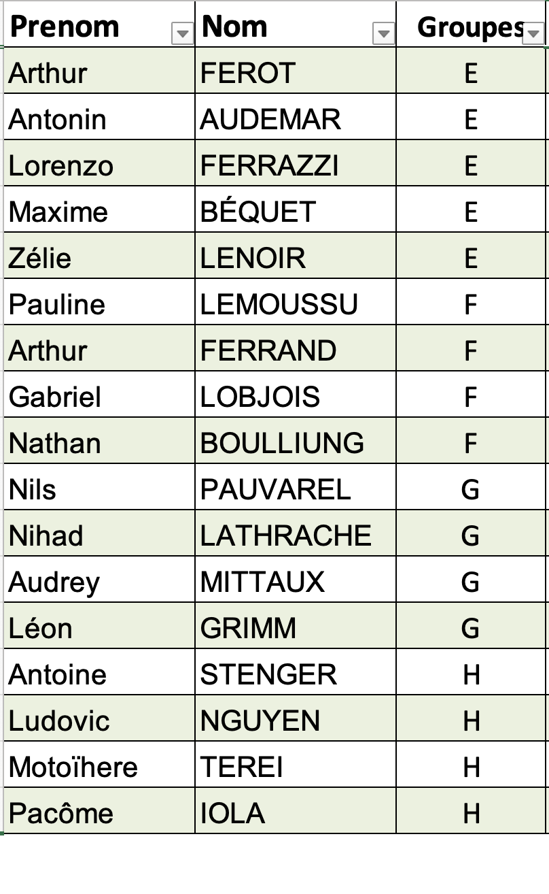
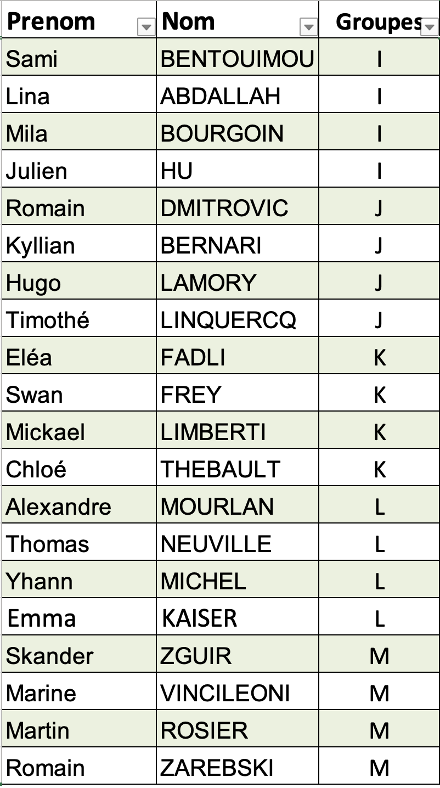
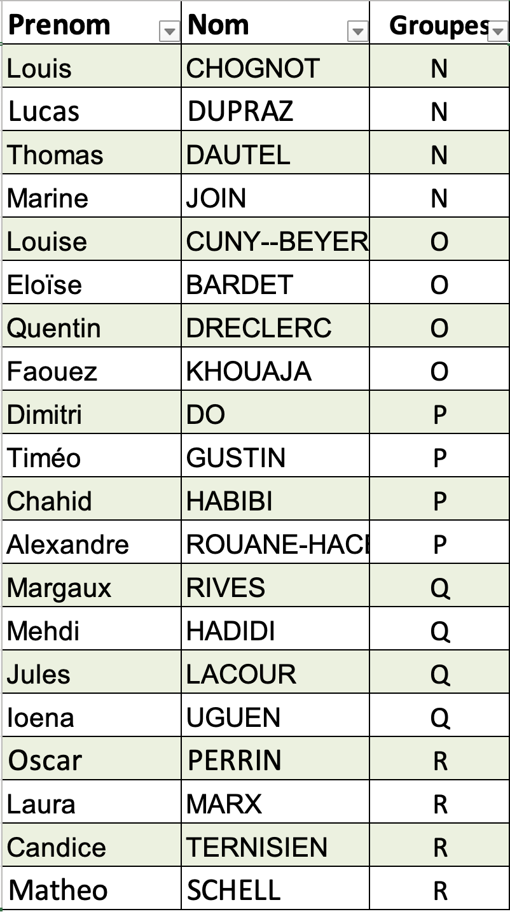

# Défi de Conception Mécanique

{width="80%" fig-align="center"}

Cette année le projet de CI3 consistera dans un **Challenge** de conception mécatronique où chaque équipe doit **concevoir**, **simuler** et **fabriquer** un mécanisme *autonome* capable de saisir un cube imprimé $6 \times 6 \times 6 cm$ posé sur une table et de le repositionner précisément au centre de celle-ci. 
*Ce projet met à l’épreuve la créativité, les compétences en ingénierie et l’ingéniosité des participants*.

## Objectifs
- Concevoir un mécanisme robuste et fonctionnel.
- Le mécanisme devra être inscrit dans une surface de $lo \times la = 30 \times 30cm$ **max**.
- Appliquer la démarche de conception, modélisation et fabrication.

## Contraintes

- **Temps**: 
  - 2 min max. de preparation avant chaque match.
  - 3 min max. par match. 
  - Non intervention des équipes sur le mécanisme, une fois que le match a debuté.

- **Matériels**: 
   - Avoir au moins une pièce en impression 3D.
   - Avoir au moins une pièce en découpe laser. 
   - Possible utilisation des elements recyclés/upcyclés exterieurs non electroniques. 
   - Prévoir des pièces de réparation si nécessaire. 
   - Aucune modification de l'arène est possible.
   - L'arène sera mise à disposition pendant et dehors du cours.

- **Électroniques**: 
   - Utilisation maximal d'un micro-controleur (e.g. arduino) 
   - Utilisation maximal **deux actionneurs** (e.g. moteurs pas à pas, servo-moteur, moteur piezo-electrique) dans la limites de ressources du LF2L.
   - Alimentation autonome par batteries ou piles. 
   - 1 interrupteur.
   - Pas electronique de communication (e.g. Wifi, radio)

- **LF2L**: 
   - L'accès au LF2L en dehors de séances de cours prévues, est soumis à réservation et validation par [Benjamin Ennesser-Serville - benjamin.ennesser-serville@univ-lorraine.fr](mailto:benjamin.ennesser-serville@univ-lorraine.fr).
     - \textcolor{red}{Réservation préalable 48h a l'avance.}
     - \textcolor{red}{Lors de la réservation, veuillez indiquer votre groupe (1.1, 1.2, 2.1 ou 2.2) ainsi que votre équipe (A, B, C, etc.).}
     


## Critères d’évaluation

### Tournoi

La soutenance prendra la forme d’un **tournoi par élimination,** où les équipes s’affronteront en plusieurs phases : qualification, quarts de finale, demi-finales et finale.


### Déroulement des Épreuves

::: {.callout-important title=""}
La compétition se déroulera en deux étapes :

1. **Test individuel** : Évaluation du mécanisme en fonctionnement autonome, sans adversaire.
    - 3 essais maximum pour évaluer le bon fonctionnement de votre mécanisme.

2. **Test en confrontation directe** : Affrontement entre deux équipes sur la même arène.
   -  Chaque match se joue en 2 manches gagnantes.

\color{MidnightBlue}
3. **Joker** (seulement pour les 3 premiers rounds) :
  - Les équipes éliminées auront une chance de réintégrer la compétition grâce à une roue aléatoire :  [En utilisant par exemple: https://spinthewheel.io/fr](https://spinthewheel.io/fr) 


**Note** :
*Pour mieux gérer le temps, le format des confrontations directes pourra être ajusté en cours de route.*
:::


#### Distribution des matchs


\color{black}


## Critères de Victoire

1. Le mécanisme gagnant est celui qui parvient à emboîter son cube dans le logement central de l’arène le plus rapidement.

2. Si aucun mécanisme n’y parvient, la victoire sera attribuée à celui qui amène son cube le plus proche du centre. 
   - La distance minimale entre le cube et le centre sera prise en compte.. 

3. En cas de match nul, une nouvelle confrontation aura lieu.

::: {.callout-note title=""}
**Le gagnant du challenge sera le mécanisme qui systèmatiquement gagne à chaque confrontation**
::: 

### Règles Techniques et Comportementales

- Bien qu’il n’y ait pas de limite de hauteur, le mécanisme devra être inscrit dans un volume dont la surface de base est de $lo \times la = 30 \times 30cm$ **max**. Toutefois, une fois démarré, il pourra sortir de cette zone ainsi que du champ de l’arène.
- La compétition commencera à partir *d’un signal de départ commun*.
- Le mécanisme doit être activé par **une seule action** *mécanique* **OU** *électrique* (par exemple, actionner un interrupteur, couper un fil).
    - En revanche, il est accepté si l'action initiale déclenche deux éléments de façon simultanée.
- Le mécanisme doit fonctionner de façon **autonome** une fois que le signal de départ est donné.
- Aucun mécanisme ne doit être fixé au support de table : *tout ancrage physique est interdit*.
- Les *stratégies d’obstruction ou de blocage* sont autorisées, à condition que :
   - Elles sont initialement installées dans la surface initiale.;
   - Une fois le match commencé, le mécanisme peut éventuellement sortir de la surface de jeu.
   - Elles n’impliquent pas d’attaque directe sur le mécanisme dans les zones de sécurité $lo \times la = 30 \times 30cm$;     
- **Tout mécanisme conçu pour attaquer directement le cube de l’adversaire sans déplacer son propre cube sera disqualifié**.
- Il est interdit d’utiliser des substances dangereuses, telles que des explosifs ou des fluides.


### Critères d'évalution lors du tournoi

Indépendamment du résultat du challenge, toutes les solutions proposées seront évaluées selon plusieurs critères :


```{r setup, include=FALSE, echo=FALSE}
knitr::opts_chunk$set(echo = FALSE, fig.retina = 3, message = FALSE, warning = FALSE)
options(knitr.kable.NA = '')


library(tidyverse)
library(kableExtra)
library(readxl)

table1 <- read_excel("Criterios-evaluation.xlsx")

```

```{r}
table1 %>%
  mutate_all(linebreak) %>%
  kbl(caption = "Critères d'évaluation", 
                booktabs = T,
                #linesep = "\\midrule\\addlinespace"
                align = c("llllccc")) %>%
   kable_styling(full_width = F, 
                latex_options = c("HOLD_position"), 
                font_size = 9) %>% 
  add_header_above(bold = TRUE, c(" " = 4, "Critères d'Évaluation" = 3)) %>% 
   row_spec(0, color = "black", background = "white", bold = T, font_size = 11) %>%
   collapse_rows(columns = 1:2,  row_group_label_position = c("first")) %>%
   column_spec(1, width = c("2cm"), bold = T)  %>%
   column_spec(2, width = c("2cm"))  %>%
   column_spec(3, width = c("2cm"))  %>%
   column_spec(4, width = c("3.5cm"))  %>%
   column_spec(5, width = c("1.5cm"))  %>%
   column_spec(6, width = c("1.5cm"))  %>%
   column_spec(7, width = c("1.5cm"))  
```


### Rapport complémentaire 
En complement de ce compétition, chaque groupe devra réaliser: 

1. **Vidéo de présentation du concept**: Une vidéo détaillant le concept du projet, d'une durée maximale de 3 minutes. Elle doit permettre de comprendre rapidement l’objectif, le fonctionnement et l'originalité de la solution proposée.

1. **Documentation complète du projet**:
À publier sur la plateforme Fabmanager : [https://fabmanager.lf2l.fr/](https://fabmanager.lf2l.fr/).
Cette documentation doit contenir toutes les informations techniques, visuelles et descriptives nécessaires à la compréhension et à la reproduction du projet.

1. **Rapport technique complémentaire (15 à 20 pages)**:
Ce rapport doit inclure les éléments suivants :
    - Contexte et analyse fonctionnelle du problème traité.
    - *Phase d’exploration* : synthèse de la veille technologique et des concepts envisagés.
    - *Phase de conception* : choix de la solution retenue, fabrication des premières maquettes.
    - *Phase d’itération* : évolution du projet à travers les tests, comparaison entre les prototypes successifs, justifications des modifications apportées.
    - *Phase d’évaluation* : tests de performance, analyses techniques, notes de calculs.
    - *Références bibliographiques* utilisées tout au long du projet.

1. **Maquette numérique (CAO)**:Réalisation sur Onshape, incluant une simulation fonctionnelle du système.

1. **Prototype physique fonctionnel**:Le prototype doit être entièrement opérationnel le jour de la compétition, capable de démontrer les fonctionnalités prévues.


::: {.callout-note title="ARCHE"}
L’Ensemble des rendus de concernant le rapport CI3  sont à rendre par un fichier sous ARCHE pour le **Vendredi 30/05 à 17h**. 
:::

## Ressources
- Lorraine Fab Living Lab (LF2L)
- Composants électroniques Arduino disponibles au LF2L. (Voir document sous ARCHE)

::: {.callout-warning title="Rétour de composants éléctroniques"}
**Tous les composants électroniques doivent être restitués à la fin du match.** 

| Référence                                                     | Quantité |
|---------------------------------------------------------------|----------|
| Kit de complément d'engrenages Kitronik TGP01S-A130           | 1 ou 2   |
| Servomoteur Parallax Inc, 140 mA, 4→6 V                       | 1 ou 2   |
| Porte-pile 6 x RS PRO AA, raccordement Fils                   | 1        |
| Piles rechargeables AA 2Ah RS PRO, NiMH, 1.2V                 | 6        |
| Platine d'essai, RS PRO, Dimensions de 82.5 x 54 x 9mm        | 1        |
| Romeo DFRobot                                                 | 1        |
| Fiche d'alimentation CC, 1A, Ø 2.1mm, Montage sur câble, 16 V | 1        |
| Câble USB 2,0 type A/B                                        | 1        |

:::


## Objectifs des TP5 - TP9

- TP5: Déclaration du problème de conception, analyse fonctionelle et benchmark de concepts de solution possibles. (OIC 1 à déposer sous ARCHE)
- TP6: Créativité et conception.
- TP7: Maquettage.
- TP8: Fabrication, assemblage et évaluation.
- TP9: Amélioration et mise au point.


# Répartition des Groupes


::: {layout="[40, -5, 40]" layout-valign="center"}

{width="220px" fig-align="center"}

{width="220px" fig-align="center"}

{width="220px" fig-align="center"}

{width="220px" fig-align="center"}

:::


