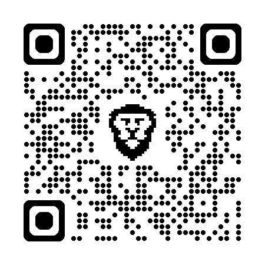

::: {.callout-tip title="But de ce document"}
Comme tout processus de conception, le module CI3 est en évolution constante afin de mieux développer les compétences d’une ingénierie de l’innovation adaptée aux enjeux du $XXIe$ siècle.

Ce document a pour objectif de **recueillir votre retour d’expérience** afin d’identifier vos perceptions, suggestions et axes d’amélioration, dans une démarche d’amélioration continue au service des futurs ingénieur.es de l’ENSGSI.

Merci de bien vouloir partager vos remarques concernant :

- l’équipe pédagogique (enseignants, techniciens, étudiant·es auxiliaires, etc.)
- le contenu du cours,
- la méthodologie pédagogique,
- les ressources utilisées (LF2L, ARCHE, FabManager, etc.)

:::

# Questions

::: {.questions}
[]{.question} 
Quels sont, selon vous, les éléments positifs du module que vous avez appréciés et qui devraient être conservés ou renforcés pour les futurs étudiant(e)s de l’ENSGSI ?

:::{.solutionbox arguments="4cm"}

:::

::: {.callout-note title="Référentiel Emploi-Compétences (REC) del'ENSGSI"}

:::{layout="[70, 30]"}
:::{}
Le module CI3 travaille  spécifiquement les compétences:

1. **C2:** Maîtriser les Science pour l'Ingénieur nécessaires au métiers de l'Innovation.
   - Compétences: *C2.1, C2.2, C2.3*

1. **C3** : Élaborer et implémenter des processus d'Innovation
   - Compétences: *C3.2*
:::

{width="100px" fig-align="center"}

:::
:::

[]{.question} 
En revanche, quelles sont, selon vous, les éléments dont vous pensez qu'ils devront être enlevés du module CI3 car ils ne correspondent pas au *Référentiel Emploi-Compétences (REC)* de l'ENSGSI?

:::{.solutionbox arguments="4cm"}
:::

[]{.question} 
Quelles sont les pistes d’amélioration et/ou suggestions possibles pour ce module dans le contenu, rythme, encadrement, supports, etc.?

:::{.solutionbox arguments="5cm"}

:::

[]{.question} 
Avez-vous un commentaire, un remerciement ou une critique constructive que vous souhaiteriez adresser à l'équipe pédagogique de l'ENSGSI, en lien avec votre expérience cette année dans le module, et que vous jugez important de mettre en avant ? Vous pouvez également simplement partager un ressenti lié à votre vécu.

:::{.solutionbox arguments="6cm"}

:::

:::

\flushright 

**Merci beaucoup**

A bientôt en 2AI

Fabio Cruz