# How it started... {.center}

{width="500px"  fig-align="center"}

## { background-image="2026/Started-00.png" background-size="cover" style="color: #642C81"}

## { background-image="2026/Started-01.png" background-size="cover" style="color: #642C81 "}

--- 

::: {.r-fit-text  style="color: #642C81 "}
 
How it's going ...
:::

## {background-image="challenge/2026.png" background-size="cover" style="color: #FFFF"}

::: {.r-stack}

{ .fragment width="900px" fig-align="center"}

{.fragment width="1000px"  fig-align="center"}

{.fragment width="1200px"  fig-align="center"}

:::

## {background-image="2026/photos/IMG_5873.jpeg" background-size="cover" }

## {.center}

::: {.r-fit-text style="color: #642C81 "}
 
En tout cas...
:::

## {.center}

::: {.r-fit-text style="color: #642C81 "}
 
Merci de vous être engagés jusqu'au bout de ce module.
:::

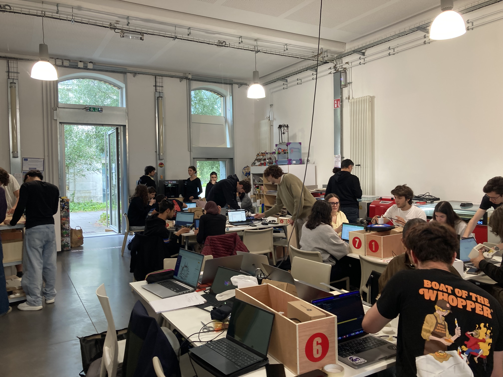{width="500px" fig-align="center"}

## Avant de démarrer avec les hostilités.. {.center}

## Teaser video sous Arche!! {background-image="challenge/teaser.webp" background-size="50%" }

## Votre feedback est important! {background-image="challenge/feedback.png" background-size="50%" }

## On recupère l'**Electronique** et les pièces en **impression 3D** ♻️ ❗❗

{width="500px"  fig-align="center"}

## Pour vous!



## Merci à l'équipe LF2L!

{.absolute  top=200 left=100 width="500px"} 

{.absolute top=200 right=100 width="600px"} 

## Et maintenant ! {.center}

## et maintenant !

{fig-align="center"}

# Welcome   Challenge CI3! {.center}

## Règles du Jeu

::: {.callout-important title=""}
La compétition se déroulera en deux étapes :

1. **Test individuel** : Évaluation du mécanisme en fonctionnement autonome, sans adversaire.
    - 3 essais maximum pour évaluer le bon fonctionnement de votre mécanisme.

2. **Test en confrontation directe** : Affrontement entre deux équipes sur la même arène.
   -  Chaque match se joue en 2 manches gagnantes.

**Note** :
*Pour mieux gérer le temps, le format des confrontations directes pourra être ajusté en cours de route.*
:::

🕒 9:00 - 12:00 !

## {background-image="2026/Matchs.png" background-size="90%"}

:::footer

[Ranking CI3](https://www.canva.com/design/DAGoWou_r5A/R6BQfmlracbm1fvZPrweBQ/edit){target="_blank"}

:::

## Notre Jury

::: {.r-stack}

{.absolute  top=100 left=300 width="400px"} 

{.fragment  .absolute  top=100 right=300 width="400px" }

{.fragment  .absolute  top=300 left=0 width="400px" }

{ .fragment  .absolute  top=300 right=0 width="400px" }

:::

## Grille d'Evaluation

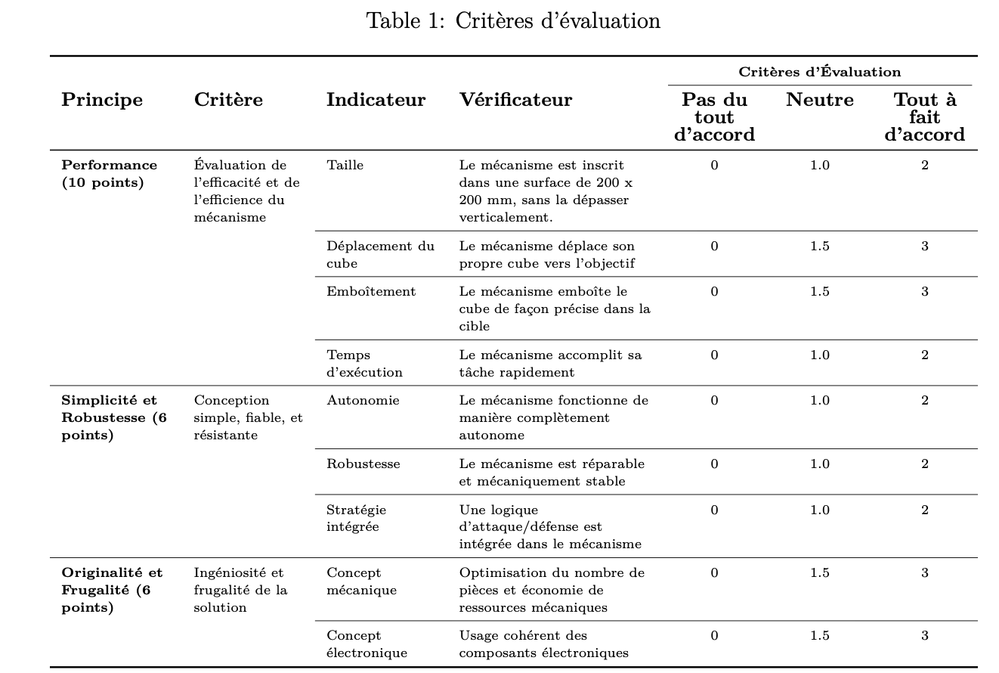{width="100%" fig-align="center"}

## Des questions? {.center}

## Est qu'il y a une mauvais note si on perd le challenge?

Non, mais rappellez-vous...

:::{layout="[45,-5, 45]" layout-valign="top"}

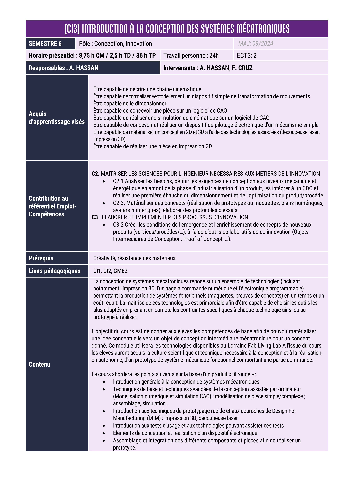{width="100%" fig-align="center" group="syllabus" .lightbox}

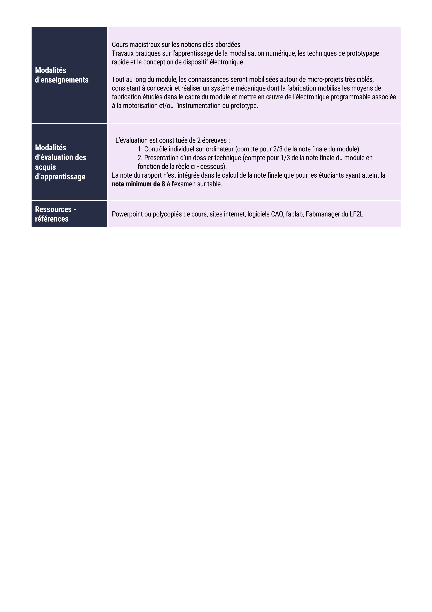{width="100%" fig-align="center" group="syllabus" .lightbox}

:::

---

## Est qu'il y a un prix pour les gagnants?

{width="100%" fig-align="center"}

## Est qu'il y a un prix pour le gagnant?

{width="100%" fig-align="center"}

## D'autres questions?

{width="100%" fig-align="center"}

# Commençons !!

{width="100%" fig-align="center"}

## Happy 4 Friends Vs Les Techniciens de l'Extreme

:::{layout="[45,-5, 45]" layout-valign="top"}

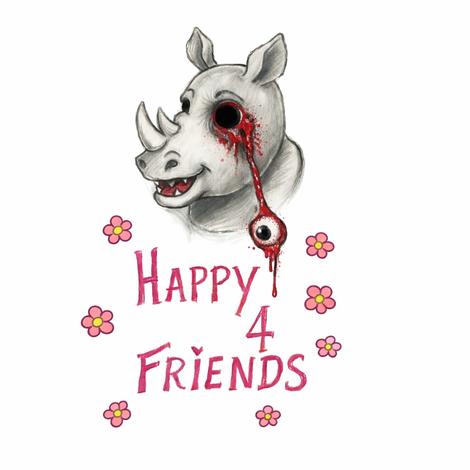{width="600px" fig-align="center"}

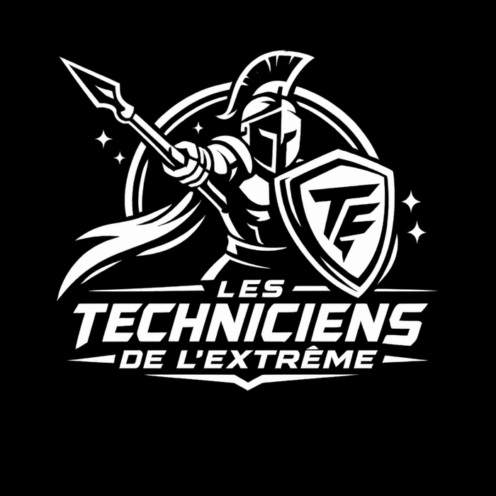{width="500px" fig-align="center"}
:::

### Happy 4 Friends Vs Les Techniciens de l'Extreme

:::{layout="[40,-5, 40]" layout-valign="top"}





:::

## Volt Vs Sentinelle

:::{layout="[45,-5, 45]" layout-valign="top"}

{width="600px" fig-align="center"}

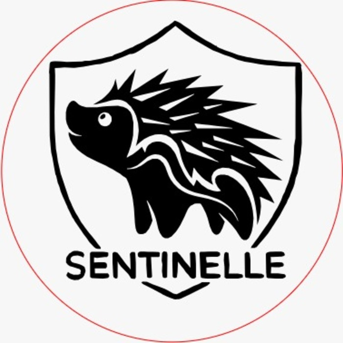{width="600px" fig-align="center"}

:::

### Volt Vs Sentinelle

:::{layout="[40,-5, 40]" layout-valign="top"}





:::

## Drift Vs Disruptor

:::{layout="[45,-5, 45]" layout-valign="top"}

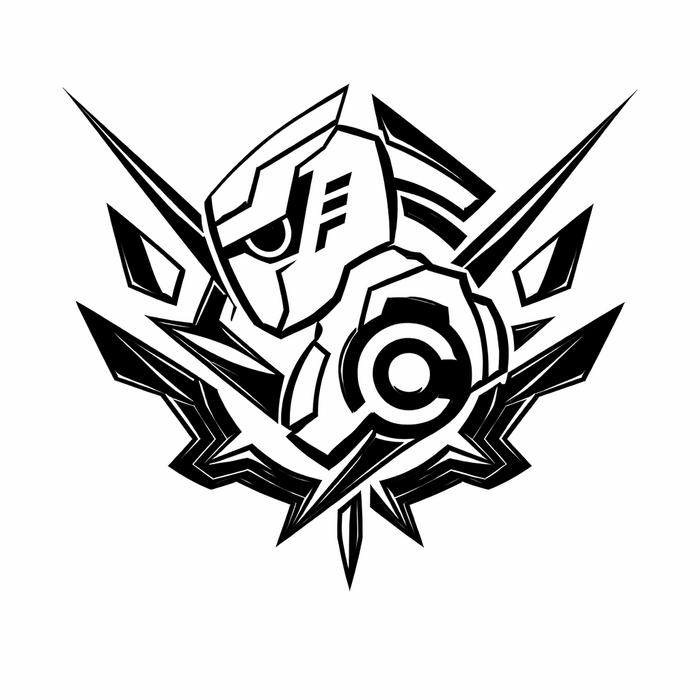{width="600px" fig-align="center"}

{width="600px" fig-align="center"}

:::

### Drift Vs Disruptor

:::{layout="[40,-5, 40]" layout-valign="top"}





:::

## VengeanceX Vs Bosslady

:::{layout="[45,-5, 45]" layout-valign="top"}

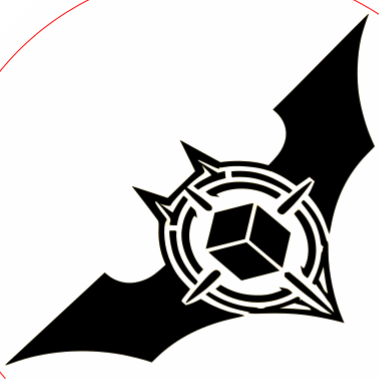{width="600px" fig-align="center"}

{width="600px" fig-align="center"}

:::

### VengeanceX Vs Bosslady

:::{layout="[40,-5, 40]" layout-valign="top"}





:::

## JAQA Vs Destroyer 67

:::{layout="[45,-5, 45]" layout-valign="top"}

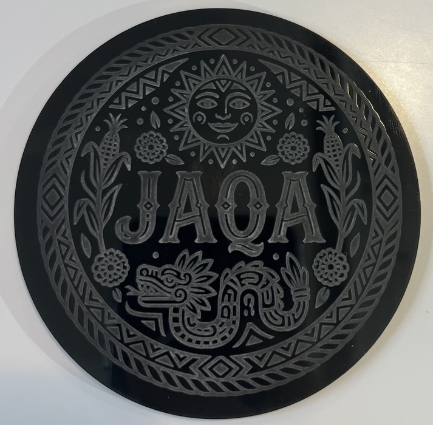{width="600px" fig-align="center"}

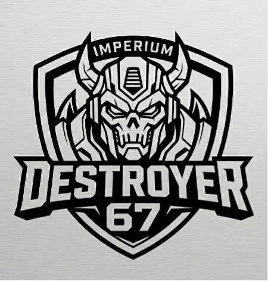{width="600px" fig-align="center"}

:::

### JAQA Vs Destroyer 67

:::{layout="[40,-5, 40]" layout-valign="top"}





:::

## Novaflash Vs Manyack

:::{layout="[45,-5, 45]" layout-valign="top"}

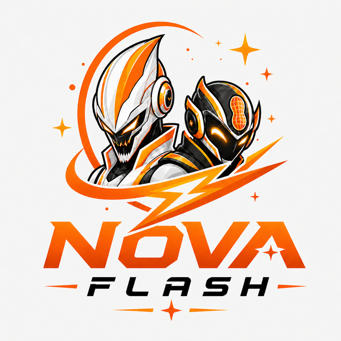{width="600px" fig-align="center"}

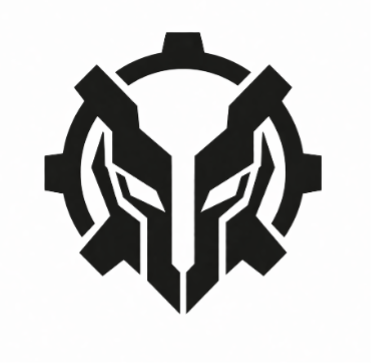{width="600px" fig-align="center"}

:::

### Novaflash Vs Manyack

:::{layout="[40,-5, 40]" layout-valign="top"}





:::

## Totally Bots Vs MechaFury

:::{layout="[45,-5, 45]" layout-valign="top"}

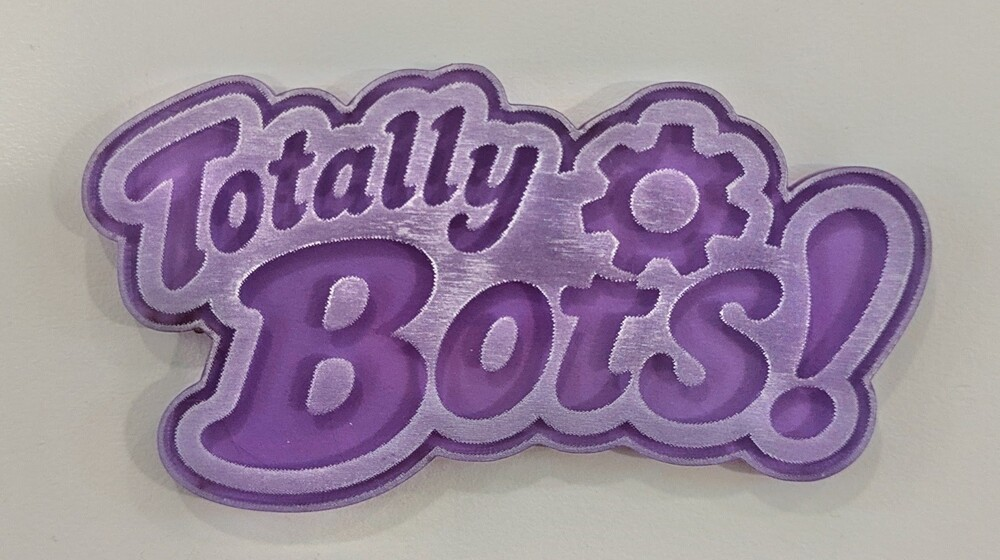{width="600px" fig-align="center"}

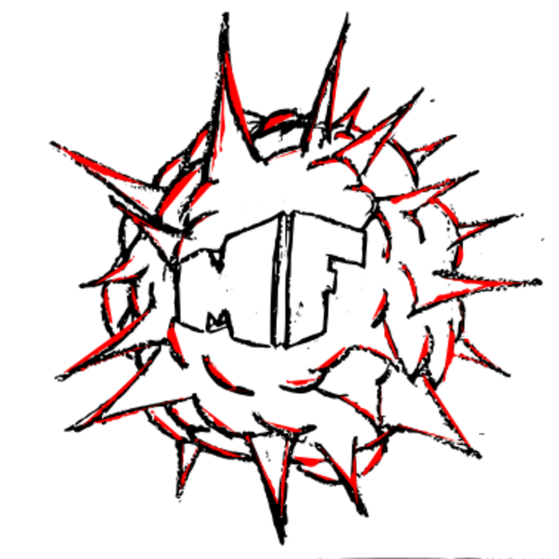{width="600px" fig-align="center"}
:::

### Totally Bots Vs MechaFury

:::{layout="[40,-5, 40]" layout-valign="top"}





:::

## TentaCube Vs The Cube

:::{layout="[45,-5, 45]" layout-valign="top"}

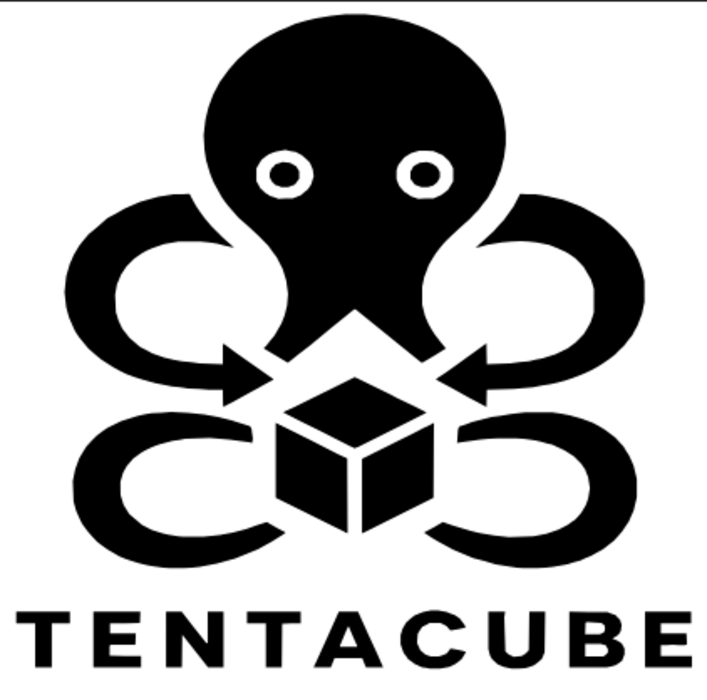{width="600px" fig-align="center"}

{width="600px" fig-align="center"}

:::

### TentaCube Vs The Cube

:::{layout="[45,-5, 45]" layout-valign="top"}




:::

